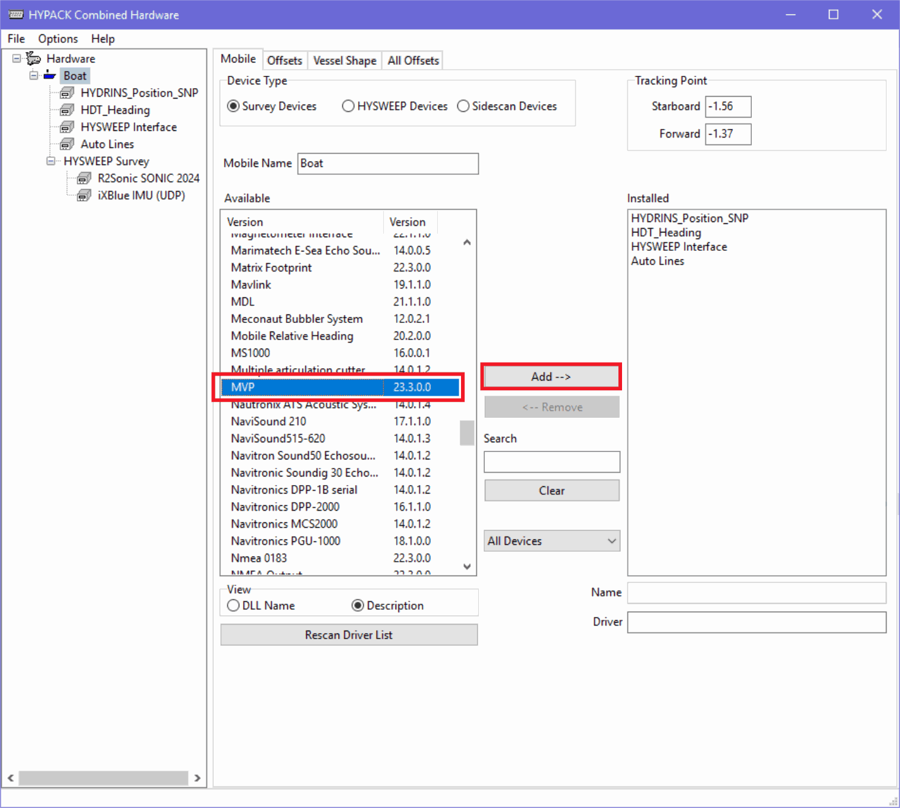
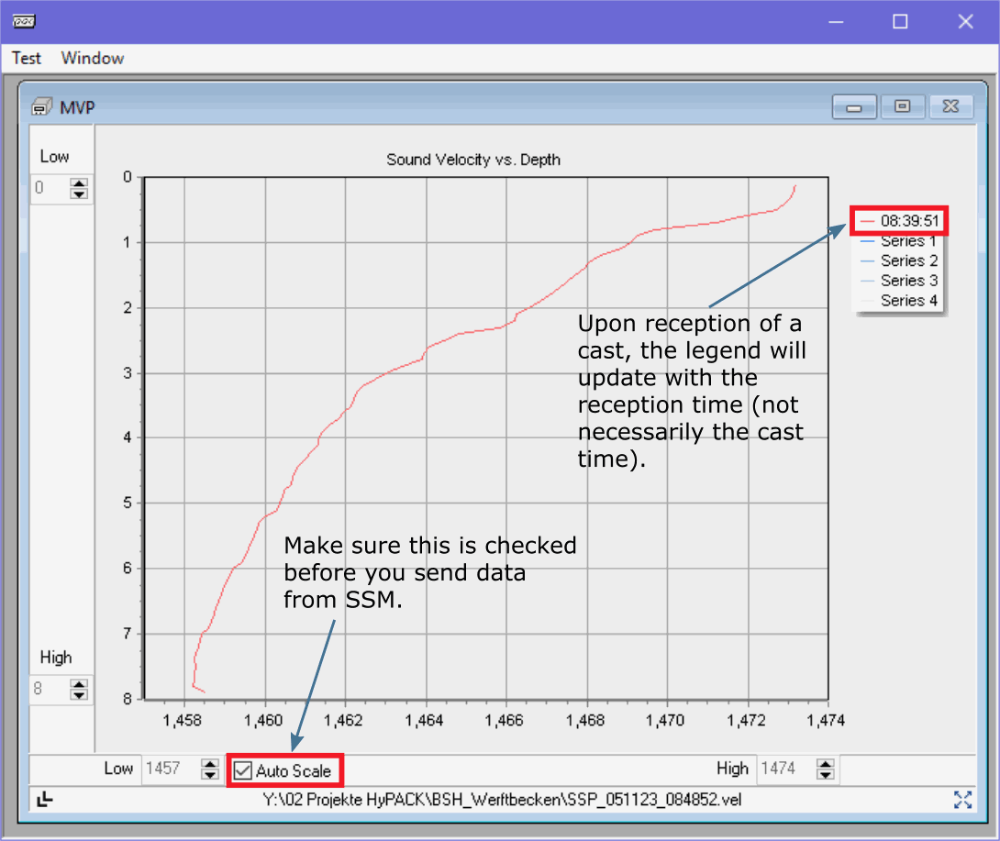
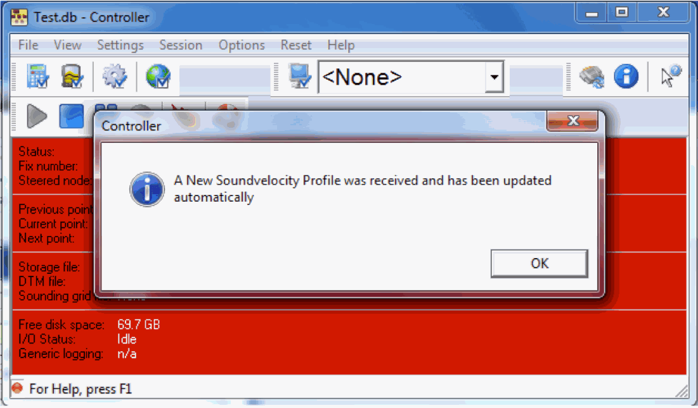
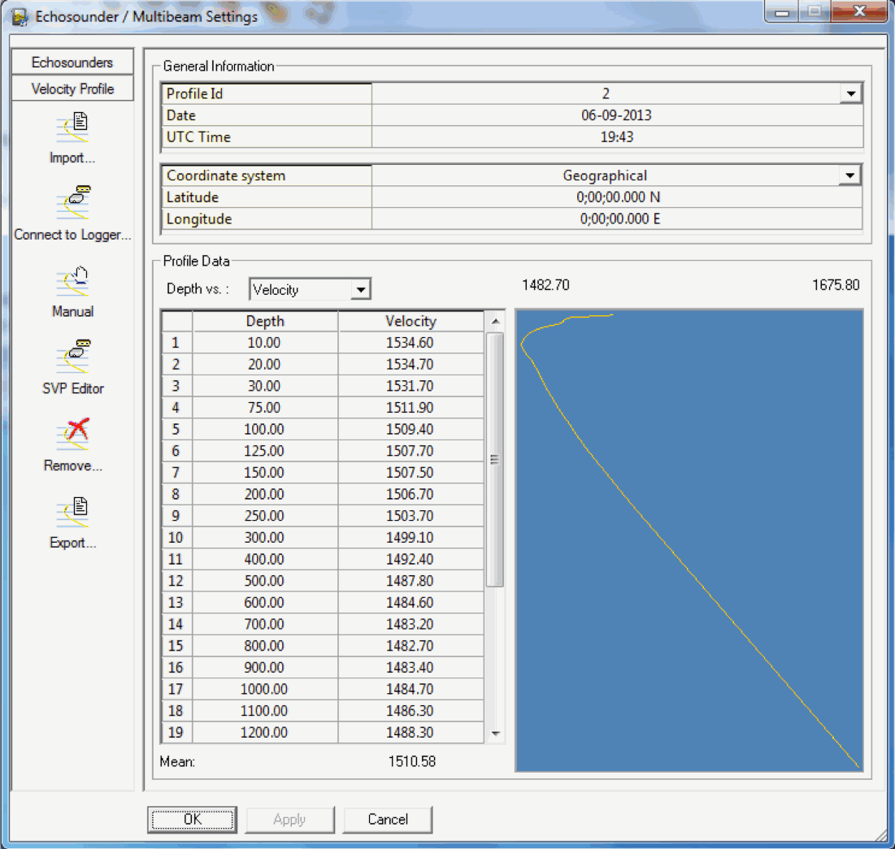
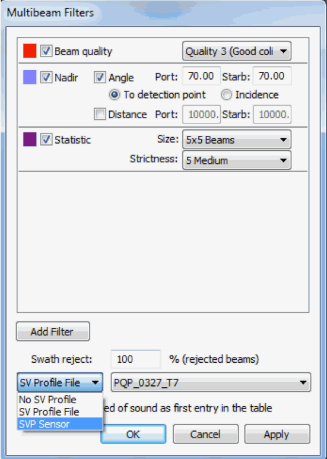
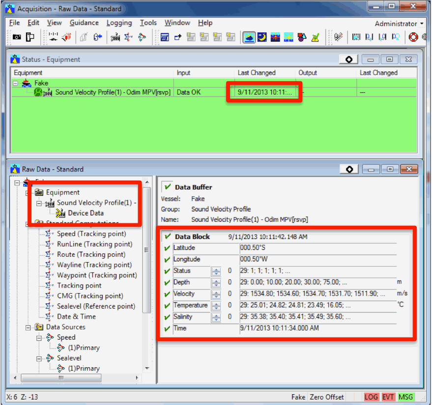

.. _app_b_connection_settings:

********************************
Appendix B - Connection Settings
********************************

Settings for data reception
===========================

Moving Vessel Profiler
----------------------

The MVP controller interface can be configured to transmit data via UDP using a variety of data format
and transmission protocols (:ref:`mvp_configuration_fig`).

.. _mvp_configuration_fig:

.. figure:: ./_static/mvp_configuration.png
    :width: 600px
    :align: center
    :height: 400px
    :alt: alternate text
    :figclass: align-center

    Figure – MVP Controller configuration dialog. Boxes A through C are required for transmission of cast information. Box D can be configured to transmit sensor data.

The MVP computer IP address and the IP address of the machine running the *SSM* package can be configured in *Box A*.
For newer versions of the MVP controller, it is recommended to choose the ``NAVO_ISS60`` transmission protocol
as this will allow for large cast files to be transmitted in several packets without overflowing
the UDP maximum packet size limitation (*Box B*). Older versions of the MVP controller software
(up to version ``2.35`` to the best of our knowledge) do not support the ``NAVO_ISS60`` protocol and
the package must be configured to use the ``UNDEFINED`` protocol in the SSP package configuration file.
The file format can be adjusted to accommodate a CTD with the ``S12`` format or a sound speed sensor
with the ``CALC`` or ``ASVP`` formats (Box C).

Note that the transmission protocol and file format must be configured in both the MVP controller interface and
in the the *Setup* tab (in the *Input* tab, to activate the MVP listener and, in the *Listeners* sub-tab,
for the communication settings).

Boxes D and E refer to raw instrument transmission settings that are configurable for future use.
Since casts received from an MVP system do not have a filename embedded in the data stream,
the *Sound Speed* package will name casts received using the following convention: ``YYYYMMDD_HHMMSS_MVP``.
The date/time stamp embedded in the filename will be the time of the cast.

.. note:: Once the MVP listener is activated, a "MVP" token will be visualized on the left side of the SSM's status bar.

Sippican
--------

There does not currently exist any internal mechanism in the Sippican software to broadcast data via UDP,
this capability has been included to accommodate vessels that use UDP network broadcasts
to log data from various systems. The expected data format is the Sippican native ``.EDF`` file format.

Note that a single Sippican data file can sometimes exceed the maximum buffer size for UDP packet transmissions.
If software is written to transmit Sippican data files via UDP, this limitation should be kept in mind.
The *Sound Speed* package currently only accepts transfer of a single UDP packet thus transmission software may need
to reduce the data by thinning the profile. Received profiles will use the filename embedded in the .EDF.

Settings for data transmission
==============================

The *Sound Speed* package can be configured to transmit data to a number of systems by selecting the *Transmit data*
button in the *Editor* tab.

For installations with multiple clients, the *Sound Speed* package will deliver the cast sequentially to all clients.
Failure on transmission to one client will not interfere with other clients. However, it will slow down
the transmission sequence through all clients for any clients who are timing out on confirmation of reception
as the *Sound Speed* package will wait up to the 'RX timeout' value defined in the setup (default: 20 seconds) for confirmation.

.. note:: Server mode will only *currently* work with the *SIS* transmission protocol.

.. _sis4:

Kongsberg SIS v4
----------------

*SIS v4* does not require additional configuration to receive sound speed files since it always listens on port 4001
for input sound speed data.

The following indications are useful for monitoring reception of sound speed profiles:

* The SSP profile filename will be updated in the Runtime parameters menu in the form: ``YYYYMMDD_HHMMSS.asvp``.
  The date and time fields are populated based on the time stamp in the profile that was received from the SSP package.
  In the case of measured casts, this is the time of acquisition, as found in the input file.
  In the case of synthetic WOA profiles, the date/time is based on the time of transmission of the cast
  (using the computer clock where the SSP package is installed).
* *SIS* creates several files in the last location from which it loaded a sound speed profile.
* The SVP display window, if being viewed in *SIS*, will update with the new cast.
* In the event that a cast is rejected, *SIS* will launch a warning dialog to indicate that the cast it received was rejected.

Although *SIS v4* will always allow incoming sound speed transmissions, it has several restrictions
that must be observed in order for the data to be accepted (see *Kongsberg manual*).
As this particular transmission protocol is used by other acquisition systems, it is worth describing in detail
what the *Sound Speed* package does to the cast data to satisfy the input criteria for *SIS*.

The transmission procedure used by the SSP package will format the temperature and salinity profiles
into the Kongsberg Maritime format. Since the WOA09/RTOFS grids only extend to a maximum depth of 5,500 m,
the profile undergoes a final extrapolation to a depth of 12,000 m to satisfy *SIS v4* input criteria,
this is done with temperature and salinity values measured in the Mariana Trench by *Taira et al. (2005)*.

Since *SIS v4* input profiles have a limit on the maximum allowable number of data points,
the sound speed profile is thinned using a modified version of the Douglas-Peucker line reduction method
as described by *Beaudoin et al. (2011)*. The algorithm begins with a small tolerance and increases it linearly
until the number of points in the profile falls below the maximum allowed by *SIS*.

By default, the cast header is formatted to instruct *SIS v4* to accept the profile for immediate application
without launching the *Kongsberg SVP Editor*. This behavior can be changed through the configuration file
by setting *Auto apply profile* to *False* (in the *Setup* tab). In this case, *SIS v4* will accept the cast
but will then launch its own editor interface and user interaction will be required on the *SIS v4* computer
in order to have the cast applied to the multibeam system.

Once the cast has been prepared for transmission, it is sent to *SIS v4* via UDP transmission over the network.
If *SIS v4* receives the profile and accepts it, it will rebroadcast the SVP datagram.
The *Sound Speed* package waits for this rebroadcast to ensure reception of the cast. The profile that was re-broadcasted
from SIS is compared against that which was sent. If they match, then the transmission is considered successful.
If there is a discrepancy, or if no rebroadcast profile is received, the user is notified that reception
could not be confirmed. The lower left status bar notifies the user of the various stages of this verification process.

In deep water, the rebroadcast event may take several seconds to occur and the software will wait up
to a user-defined amount of time (e.g., 20 seconds) for reception of the re-broadcasted SVP.
All other package functionalities are suspended during this wait period.

Hypack
------

The *Sound Speed* package can transmit data to *HYPACK* using *HYPACK*'s driver
for Moving Vessel Profiler (MVP) systems (``MVP.dll``). Next figures provide a guidance on how to configure
a Hypack project to receive data from SSP package.

.. _hypack_1_fig:

.. figure:: ./_static/hypack_1.png
    :width: 600px
    :align: center
    :height: 400px
    :alt: alternate text
    :figclass: align-center

    Step 1: opening the project manager.

.. _hypack_2_fig:

.. figure:: ./_static/hypack_2.png
    :width: 300px
    :align: center
    :height: 400px
    :alt: alternate text
    :figclass: align-center

    Selecting or creating a Hypack project.

.. _hypack_3_fig:

    Selecting the Add device button.

.. _hypack_4_fig:

    Adding device drivers to a Hypack project.

.. _hypack_5_fig:

    Adding the MVP device driver.

.. _hypack_6_fig:

.. figure:: ./_static/hypack_6.png
    :width: 600px
    :align: center
    :height: 400px
    :alt: alternate text
    :figclass: align-center

    Configuring the MVP driver. The network parameters of the driver are configured to use a UDP input protocol in a client role. The host IP address must match the address used by the computer running SSP and the reception port must match the port configuration chosen in the package configuration file. The “Write Port” is left as zero.

.. _hypack_7_fig:

    Additional configuration of the MVP device driver.

.. _hypack_8_fig:

.. figure:: ./_static/hypack_8.png
    :width: 600px
    :align: center
    :height: 400px
    :alt: alternate text
    :figclass: align-center

    Testing reception capabilities in Hypack. After having loaded a sample cast into SSP and send it, the profile should be visualized in Hypack (after clicking “Test” button).

QINSy
-----

QINSy accepts the same SVP transmission protocol as *SIS*, but a method to verify reception of the cast is
not currently known thus the user should confirm reception in the acquisition system.

.. _qinsy_1_fig:

.. figure:: ./_static/qinsy_1.png
    :width: 600px
    :align: center
    :height: 400px
    :alt: alternate text
    :figclass: align-center

    Select *Setup* from the QINSy console after loading your project. Refer to QINSy documentation for information regarding setting up a project.

.. _qinsy_2_fig:

    Edit your project database

.. _qinsy_3_fig:

    Right click the *Auxiliary Systems* icon and select *New System*.

.. _qinsy_4_fig:

.. figure:: ./_static/qinsy_4.png
    :width: 400px
    :align: center
    :height: 400px
    :alt: alternate text
    :figclass: align-center

    Configure the new system as shown above. Choose the same port number that SSP package will be sending casts to (this is configured in the ``__config__.db`` file).

.. _qinsy_5_fig:

.. figure:: ./_static/qinsy_5.png
    :width: 600px
    :align: center
    :height: 300px
    :alt: alternate text
    :figclass: align-center

    Choose *Echosounder Settings* from the *Settings* menu. This will allow you to configure the behavior of QINSy when it receives new sound speed profiles from SSP package.

.. _qinsy_6_fig:

    Left­click the icon for the *SVP Editor* device.

.. _qinsy_7_fig:

    Choose appropriate options to control QINSy’s behavior when it receives casts from SSP package. For initial testing purposes, you should at least choose to be informed after a new update.

.. _qinsy_8_fig:

    With QINSy “online” and recording, send a test profile from SSP package. If you have chosen to be informed upon reception of a new cast, a message window will appear for acknowledgement.

.. _qinsy_9_fig:

    By choosing *Echosounder Settings* from the *Settings* menu again, you can verify that the cast was received.

PDS2000
-------

PDS2000 accepts the same SVP transmission protocol as SIS, but a method to verify reception of the cast is
not currently known thus the user must confirm reception in the acquisition system.

.. _pds_1_fig:

.. figure:: ./_static/pds_1.png
    :width: 600px
    :align: center
    :height: 400px
    :alt: alternate text
    :figclass: align-center

    Adding an MVP driver to PDS2000.

.. _pds_2_fig:

.. figure:: ./_static/pds_2.png
    :width: 600px
    :align: center
    :height: 400px
    :alt: alternate text
    :figclass: align-center

    Configuring the MVP driver for PDS2000.

.. _pds_3_fig:

    Configuring an MVP driver for PDS2000. Be sure to scroll down in the list on the left side and choose the driver you added in the previous step before modifying the port number. The port number must match that which SSP package is sending data to (configured in the ``__config__.db`` file).

.. _pds_4_fig:

    After the driver is added, test the device to verify correct configuration of communication protocols.

.. _pds_5_fig:

.. figure:: ./_static/pds_5.png
    :width: 600px
    :align: center
    :height: 400px
    :alt: alternate text
    :figclass: align-center

    With the device driver open, send a test cast from SSP package. The data should appear in the Io port View window. Be sure that the correct device driver is selected from the top left list window.

.. _pds_6_fig:

    While running PDS2000 in acquisition mode, right click in the multibeam raw profile display and choose “Multibeam filters”. Choose “SVP Sensor” as the source of sound speed profiles to be used.

.. _pds_7_fig:

    While running PDS2000 in acquisition mode, you can verify reception in the Status displays and the “Raw Data” displays. Check the date, time, latitude, longitude against what you sent from SSP package.
