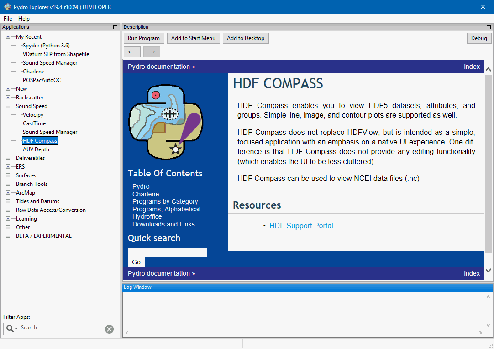
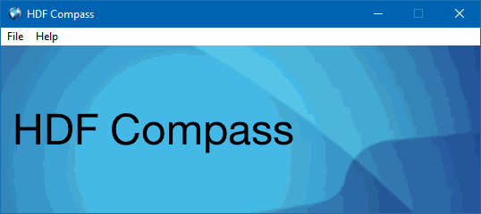
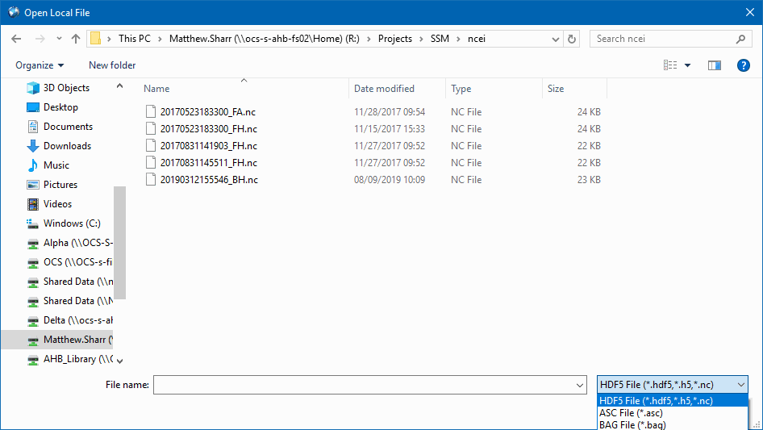

.. _app_c_view_ncei_format:

**********************************************
Appendix C - Exploring Profiles in NCEI format
**********************************************

Among many other formats (see :ref:`supported_formats`), Sound Speed Manager is able to export the loaded sound speed profiles in NCEI format.

The NCEI format requires to store the profile data and metadata in `NetCDF format <https://en.wikipedia.org/wiki/NetCDF>`_.
As such, the content of this format can be explored using applications that are able to browse the content of NetCDF file
such as `HDF Compass <https://support.hdfgroup.org/projects/compass/>`_ and `Panoply <https://www.giss.nasa.gov/tools/panoply/>`_.

About HDF Compass
=================

.. index:: hdf compass

HDF Compass enables you to view HDF5 datasets, attributes, and groups. Simple line, image, and contour plots are supported as well.
HDF Compass does not provide any editing functionality.

If you are using Sound Speed Manager with the Pydro distribution (see :ref:`pydro_installation`), you can easily
access HDF Compass from Pydro Explorer (:numref:`pydro_sound_speed_menu`).

.. _pydro_sound_speed_menu:

    Pydro Explorer Sound Speed Menu.
    
How to explore a NCEI (.nc) file with HDF Compass
=================================================

.. index:: ncei files

After opening HDF Compass from Pydro Explorer, select *File* and *Open* (see :numref:`hdf_compass_home`).

.. _hdf_compass_home:

    HDF Compass Interface.

The default file extension filter, *HDF5 File* contains the NCEI .nc file extension (see :numref:`hdf_compass_browse`).

.. _hdf_compass_browse:

    HDF Compass Browse Dialog.
    
After opening the .nc file, HDF Compass allows the user to explore different data stored in the file. To view the file metadata, using the *Window* menu, reopen the file as HDF5 attributes (see :numref:`hdf_compass_window_menu`). 

.. _hdf_compass_window_menu:

    HDF Compass HDF5 Window Menu.
    
Your .nc file attributes will open in a new window (see :numref:`hdf_compass_attributes`)

.. _hdf_compass_attributes:

    HDF Compass .nc file Attributes.
    
