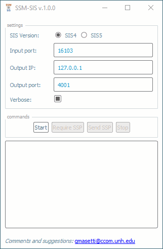
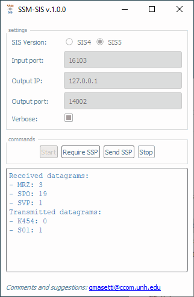

.. _ssm_sis:

***********
SSM-SIS app
***********

The SSM-SIS app is a simple application used to check the settings/interaction between Sound Speed Manager and
Kongsberg SIS (:numref:`ssm_sis_init`).

.. note::
   To avoid interference with Sound Speed Manager keep it closed while using SSM-SIS.

.. _ssm_sis_init:

    The *SSM-SIS* app with the default parameters.

.. _settings:

Settings
========

The *Settings* group box lists the app configuration settings:

* *SIS Version*: switching between SIS4 and SIS5 loads the default settings for each of the two options.
* *Input port*: the port used by SIS to broadcast the datagrams.
* *Output IP*: the IP address of the SIS machine.
* *Output port*: the port used by SIS to receive the sound speed profile. The default port should work.
* *Verbose*: this flag increases the number of debug messages printed in the windows shell by the SSM-SIS app.

Commands
========

The *Commands* group box lists the app commands:

* *Start*: to start the listening of SIS datagrams.
* *Require SSP*: to send a message to SIS that should trigger the reception of the sound speed profile currently in use
  by Kongsberg SIS.
* *Send SSP*: to send a fake sound speed profile to Kongsberg SIS. It should also trigger the reception of the same
  speed profile.
* *Stop*: to end the listening of SIS datagrams.

.. note::
   Do not use the *Send SSP* command during regular survey operations because it will trigger the transmission of a
   fake sound speed profile.

Output
======

The *Output* view provides updates on the received and transmitted datagrams (:numref:`ssm_sis_output`).

.. _ssm_sis_output:

    The *SSM-SIS* app showing the results of the interaction with Kongsberg SIS5.
