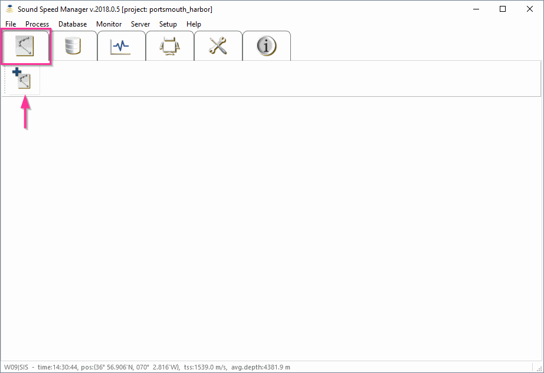
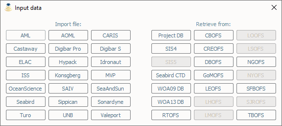
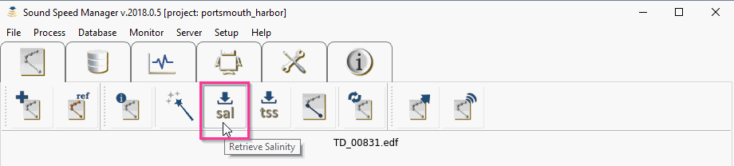
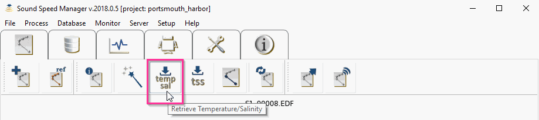
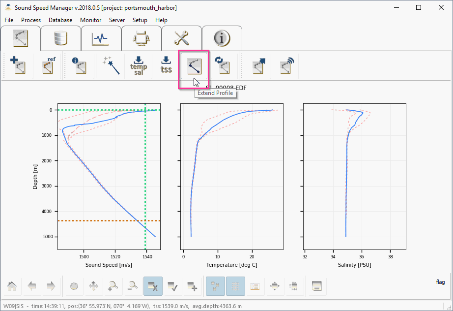
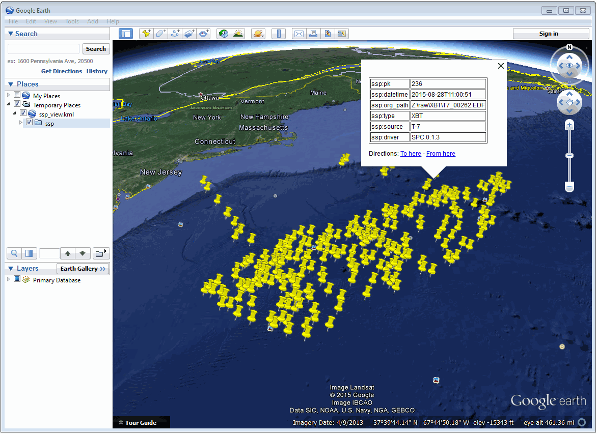

.. _operator_mode:

*************
Operator Mode
*************

.. index::
   single: mode; operator

Data import
===========

.. index::
   single: data; import

From the *Editor* tab, select *Import data* and choose the desired import file type.

    Click on the *Import data* button in the *Editor* tab to start the import process.

    Click on the desired import file type.

This will launch a file selection dialog (with the expected file extension set as a filter, e.g. ``.edf``
for *Sippican* files).

    Browse to the desired data file.

.. note:: A number of sample data files can be downloaded from the project repository.

After the selection of the desired file, the window shows panels with the sound speed, temperature and
salinity profiles drawn in solid blue (left to right, respectively, in the following figure).

.. figure:: ./_static/editor_tab3.png
    :width: 600px
    :align: center
    :height: 460px
    :alt: alternate text
    :figclass: align-center

    *Sound Speed Manager* showing the three main plots: sound speed, temperature, and salinity.

During the import stage, the geographic position and date in the input file are used to query WOA or RTOFS
atlases (if available) to obtain mean sound speed, temperature and salinity profiles (to provide a context
during data editing), which are drawn in dashed colours. Thus, it is important that the cast positional metadata
are correct for this lookup operation.

Furthemore, the position is also required by some formats to compute the pressure to depth conversion (since this
has a latitudinal dependence). Since some file formats do not support recording of geographic position
(e.g., *Valeport* ``.000``) the user must enter these manually during import (if the SIS position datagram is
not available).

Interactive data editing
========================

The mouse interactive mode is set using the plotting toolbar at the bottom (or by directly right-clicking
on the plots once a cast is loaded). Currently available inspection modes are:

* *Reset view*: to visualize the full profile
* *Pan*: to move the area visualized in the plot
* *Scale*: to modify the horizontal and vertical scales of the plots
* *Zoom in*: to zoom in to a selected area
* *Zoom out*: to zoom out from a selected area
* *Flag*: mark spurious measurements for removal from any plot panel through a left-click drag motion over the bad data points. The flagged points will be drawn in red.
* *Unflag*: reclaiming previously flagged data, using the same left-click and drag motion as *Flag*.
* *Insert*: manually adding points to the profiles can be useful to create a more realistic cast extension. This is particularly useful when the measured temperature and/or salinity values deviate from WOA/RTOFS or the reference profile near the bottom of the profile.

Zooming back out to the full view is accomplished by choosing *Reset view* from the plotting toolbar
(or by directly right-clicking on the plot and selecting *Reset view*).
The *Hide flagged* option in the plotting toolbar will toggle the display of flagged points.

.. figure:: ./_static/editor_tab4.png
    :width: 600px
    :align: center
    :height: 400px
    :alt: data editing
    :figclass: align-center

    Interactive data editing of a loaded profile.

Data augmentation
=================

Sound speed data can be augmented with WOA/RTOFS/reference salinity and/or temperature. If a reference cast has been set,
then the reference cast will be used to augment salinity and/or temperature profiles instead of the WOA/RTOFS profiles.

XBT probes
----------

.. index:: XBT

XBT probes measure the temperature of water as they drop to the seafloor. Since the speed of sound in water is
strongly affected by water temperature, this measurement can be used to estimate the sound speed profile.
Since salinity can also influence the speed of sound in water, the accuracy of the sound speed estimate
can be improved through better approximation of the water’s salinity. This approximation can be as simple as
assuming that the salinity is constant over all depths or it could be as sophisticated as using
an independent salinity depth profile from an alternate sensor such as a CTD or perhaps from an oceanographic model.

The package follows this second approach. The salinity profile is specified by selecting *Retrieve salinity*
from the *Editor* toolbar (the option is only active when an XBT cast is loaded). With this command,
the dashed WOA or RTOFS salinity profile is used to augment the XBT temperature measurement.
Since the vertical resolution of the WOA/RTOFS grids is coarse compared to the typical sampling interval
of the measured data, the salinity estimates are linearly interpolated to the depths associated
with each of the temperature observations in the measured XBT profile.

.. figure:: ./_static/editor_tab5.png
    :width: 600px
    :align: center
    :height: 100px
    :alt: data editing
    :figclass: align-center

    The *Retrieve salinity* button in the *Editor* toolbar.

The salinity plot (right-most of the three panels) will update with a salinity profile and sound speed plot
(the left-most panel) are updated with sound speed (recalculated using the new salinity estimates).
Sound speed values are calculated using the UNESCO equation (*Fofonoff and Millard, 1983*).

XSV probes
----------

.. index:: XSV

In the case of an XSV file, the user can decide to augment the measured sound speed with WOA/RTOFS temperature and
salinity through the XSV load temperature/salinity option under the *Process* menu (the option is only active
when an XSV cast is loaded).

    The *Retrieve temperature/salinity* button in the *Editor* toolbar.

.. note:: In this mode, the sound speed is NOT recalculated, the temperature and salinity are meant merely for SIS
    to compute transmission loss corrections for improved backscatter normalization.
    Thus, the application disallows the *Retrieve salinity* button in the *Editor* toolbar for XSV profiles.

Manual user insertions
----------------------

.. index:: manual insertion

There are two methods to add points, after having selected the *Insert* mode in the right-click menu or in the plotting
toolbar:

1. *Adding sound speed points in the sound speed plot.* This method adds points to the sound speed profile only and it holds the last observed temperature and salinity constant (i.e., it makes no attempt to update the temperature/salinity profiles for the chosen sound speed). Thus, this method is well suited for output formats or transmission protocols in which the temperature/salinity values are not used.

2. *Adding salinity and temperature points.* This method adds salinity and temperature points in their respective plots and then calculates the resulting sound speed based on the temperature/salinity plots. A first click in the salinity plot adds a salinity point. Then, a second click is required in the temperature profile (the depth of the first point in the salinity plot will be adjusted to match the depth of the second click). Finally, a third click in the sound speed plot computes the new sound speed point based on the previously selected depth/temperature/salinity values (the depth from the last click in the sound speed plot is NOT used, i.e., you can click anywhere in the sound speed plot).

Multipoint extensions are achieved through repeating the above sequence. If a deep extension that exceeds
the view limits is required, repeatedly clicking near the bottom of the plots will automatically adjust the view bounds.

Applying surface sound speed
----------------------------

If configured to receive data from SIS, the surface sound speed and transducer draft from the depth datagram broadcast
can be used to create a surface layer of thickness equal to the transducer draft and of sound speed equal
to the value used in beam forming (this is based on the assuption that the value comes
from the surface sound speed probe).
This operation can be achieved by selecting *Retrieve Surface Sound Speed* from the *Editor* toolbar.

    The *Retrieve Surface Sound Speed* button in the *Editor* toolbar.

If neither the surface sound speed or transducer draft values are available from a SIS data broadcast,
the software will prompt the user to input values for both.

The intent of this feature is to keep the sound speed profile and sound speed sensor values similar such that
the numerical display monitors in SIS do not warn against sound speed discrepancies between the two measurements.
It should be noted that this is done internally in SIS during their ray tracing operations,
regardless of this external processing stage: “transducer depth sound speed is used as the initial entry
in the sound speed profile used in the ray tracing calculations” (*Kongsberg, 2012*).

Using this package method, keeps the system from warning against discrepancies based on
* The uncertainty in XBT temperature measurements (± 0.1°C, roughly equivalent to ± 0.4 m/s)
* Inadequate choice of salinity in the Sippican acquisition system
* Deviations of true salinity from the mean surface salinity in the WOA/RTOFS.

Profile extension using WOA/RTOFS atlases or a reference cast
-------------------------------------------------------------

.. index:: WOA; extension
.. index:: RTOFS; extension

Profile extension can be applied by selecting *Extend profile* from the *Editor* toolbar.
This operation will extend the observed cast in depth as much as possible using the WOA/RTOFS profile.
After that, the three plot panels will be updated. If necessary, users should edit any discontinuities
between the cast in depth and the extension in the vicinity of the maximum observation depth.

The extension will only go as deep as 5,500 m as this is the deepest depth layer that the WOA/RTOFS atlases support
(more details on such an operation are provided in :ref:`app_a_oceanographic_atlases`).

However, when files are transmitted to *SIS* or exported in ``.asvp`` format, the software extends the profile
to 12,000 m depth to meet *SIS* input criteria (thus, there is no need for the user do this manually).
Similar to data augmentation for XBT probes and for XSV probes, when a reference cast is set,
this will be used to extend the cast instead of WOA/RTOFS atlases data.

.. figure:: ./_static/editor_tab8.png
    :width: 600px
    :align: center
    :height: 400px
    :alt: extend profile
    :figclass: align-center

    The *Extend profile* button in the *Editor* toolbar.

Data export
-----------

.. index:: data; export

Any file that is loaded into the package can be exported by accessing the *Export data* from the *Editor* toolbar.

.. figure:: ./_static/editor_tab10.png
    :width: 600px
    :align: center
    :height: 100px
    :alt: data export
    :figclass: align-center

    The *Export data* button in the *Editor* toolbar.

Several formats are currently supported, so the user must select the format of interest and
then choose *Export selected formats* to actually perform the export.

The export function will prompt the user for an output prefix prior to export.

.. _data_transmission:

Data transmission
-----------------

.. index:: data; transmission
.. index:: SIS

Data transmission is triggered by selecting the *Transmit data* from the *Editor* toolbar.

.. figure:: ./_static/editor_tab11.png
    :width: 600px
    :align: center
    :height: 100px
    :alt: data editing
    :figclass: align-center

    The *Transmit data* button in the *Editor* toolbar.

The recipients of such a transmission are configured in the configuration file (see :ref:`package_configuration`).
Given that the profile accepted by *SIS* often requires the application of a thinning algorithm,
a method *Preview thinning* is provided to inspect the result of such an algorithm before the actual transmission.

Data storage
------------

.. index:: database

The package provides also functionalities to permanently storage, delete and retrieve the sound speed data.
A profile can be store using *Save to database* in the *Editor* toolbar.

    The *Save to database* button in the *Editor* toolbar.

In particular, each profile may contain three types of stored data:

1. The raw data (that makes possible to redo the processing from scratch).
2. The processed samples (with flags to identify the various different source of data).
3. An optional SIS profile (that represents the result of the thinning process required by *Kongsberg SIS*).

Additional functions to export in several formats (csv, kml, shapefile) and to plot the metadata and the spatial
information for the stored SSP data set.

.. index:: csv
.. index:: kml
.. index:: shapefile

.. _kml_export_fig:

    Loading result of the exported metadata (kml format) in Google Earth.

.. _map_creation_fig:

    Example of a map created from a stored SSP data set.

.. _daily_plot_fig:

.. figure:: ./_static/daily_plot.png
    :width: 500px
    :align: center
    :height: 500px
    :alt: alternate text
    :figclass: align-center

    Example of a daily plot that can be created from a stored SSP data set.

Additional functionalities
==========================

Create a WOA or RTOFS profile
-----------------------------

.. index:: WOA, synthetic profile
.. index:: RTOFS, synthetic profile

It is possible to upload a single WOA or RTOFS profile to *SIS*.
This can be done by first select WOA09 atlas or RTOFS atlas under the *Retrieve data* in the *Editor* toolbar.

.. figure:: ./_static/editor_tab12.png
    :width: 600px
    :align: center
    :height: 100px
    :alt: data storage
    :figclass: align-center

    The *Retrieve data* button in the *Editor* toolbar.

This will trigger a series of question dialogs that will determine use of the SIS date/position input
for the query position or an user provided input. After that, a surface sound speed can be applied,
and finally the resulting cast can be sent as described in :ref:`data_transmission`.

The new cast will be given the filename YYYYMMDD_HHMMSS_WOA or YYYYMMDD_HHMMSS_RTOFS with the date/time
in the filename based on the query time of the cast.

Request profile from SIS
------------------------

.. index:: SIS, profile

The *Retrieve data* in the *Editor* toolbar can also be used to retrieve the cast currently being used by *SIS* and
use it to create a new profile.

This is only possible if the package is receiving data transmissions from *SIS*.
If it is not, the package will request a cast and will wait a few seconds until it times out on the request.
During this wait period, the package will be unresponsive to further user interaction.

If a profile is received, it will be given the name ``YYYYMMDD_HHMMSS_SIS`` with the date/time in the filename
based on the cast time recorded by *SIS*.

There are a number of shortcomings regarding the Kongsberg datagram format for sound speed profiles:

* It does not preserve the latitude/longitude of the observed cast. You will be prompted to enter the position of the cast when you request the cast from SIS. It is up to you to determine the position as accurately as you require it to be, perhaps by consulting CTD/XBT logs.
* The observation time associated with the cast is known to be incorrect in the *SIS* sound speed profile datagram format so it is not necessarily straightforward to use the observation time to look up the navigation.
* Temperature and salinity are not included in the datagram, even if they are provided to *SIS* when the associated cast was originally uploaded (they are preserved internally in SIS, however).

These shortcomings are overcome through the use of the “W” datagram in *SIS*, however, it is not currently possible
to dynamically request this datagram from *SIS* (though it is possible to have *SIS* broadcast it
as discussed in the section :ref:`method_2`).

Using a reference cast
----------------------

There are several scenarios where a CTD profile can be used as a reference cast by this package:

* To support XBT measurements by providing a salinity profile measurement in place of using an assumed constant salinity
* To augment SVP/XSV casts with temperature and salinity profiles to improve seafloor backscatter attenuation corrections
* Since CTD cast typically sample much deeper than most XBT probes, to provide an improved vertical extrapolation to the XBT cast.

To establish a reference cast, the desired cast is imported using the same mechanism described in *Data import*.
After that the profile is verified, edited and perhaps extended further in depth using an oceanographic database,
it is set as the reference profile by selecting "Reference cast" in the *Editor* toolbar.

.. figure:: ./_static/editor_tab13.png
    :width: 600px
    :align: center
    :height: 100px
    :alt: data storage
    :figclass: align-center

    The *Reference cast* button in the *Editor* toolbar.

.. Once a profile is set as the reference cast, the reference profile is drawn in yellow.
    This cast is retained in memory as the currently loaded cast to allow for additional operations,
    such as exporting or transmission to a sounder. The reference profile can be cleared from memory at any time
    via the *Clear reference cast* option under the *Tools* menu.
    Further extensions and augmentations will then use WOA/RTOFS.

.. The reference cast can be reimported into memory by choosing *Edit reference cast* from the *Tools* menu.
    This will load a copy of the reference cast into memory for further manipulation.
    If desired, the edited version can then be set as the new reference cast and will replace the previous version.
    Prior to setting a cast as the reference cast, it is advisable to export it such that future sessions
    do not need to repeat any reference cast processing. To do this, choose Export from the File menu,
    and select the .UNB format (since it is a format that can be both exported and imported).

Refraction monitor
------------------

An experimental feature has been set up to allow the user to establish the impact
of their currently loaded sound speed profile on the refraction correction by plotting swath data
with the new sound speed profile applied prior to sending the profile to the multibeam echosounder.

.. This provides a preview of the effect of the new sound speed profile allowing appropriate action
    if the results are not as expected without introducing artifacts into the multibeam data stream.

.. Figure – Refraction monitor showing the effects of new sound speed profile before its application, as well as the application of a bias using the Profile Correction slider (at the bottom)

.. As an example scenario, the currently loaded profile is requested from *SIS* and is set as the reference profile.
    A new WOA profile can then be generated using the reported position from *SIS*.

.. The refraction monitor can thus be used to evaluate if the profile in use by *SIS* does a better refraction correction
    than the WOA profile. The refraction correction from the WOA profile can be adjusted using the slider bar
    in the *Refraction Monitor*, this adds a bias to the WOA profile (units are dm/s) and then recomputes
    the new potential swath profile using the adjusted WOA profile.
    If the user decided to send this profile to *SIS* and if the refraction corrector was non-zero,
    the package will ask the user whether or not they want to apply this corrector to the currently loaded profile
    prior to sending it to the echosounder.

.. A few other notes on the *Refraction Monitor*:
    * If the *Refraction Monitor* window is closed, the slider bar corrector value is ignored during transmission of a profile.
    * The *Refraction Monitor* window will close automatically when the package closes a profile or generates a new profile.
    * If running in *Server mode*, the slider bar corrector value is applied during transmission without user confirmation.
    * The slider bar corrector value is reset to zero after transmission of the profile both for measured profiles and server profiles.

.. index:: refraction; monitor

Network data reception
----------------------

The package is configurable to listen on specified ports for UDP input of sound speed cast data.
Currently supported systems are *MVP* and *Sippican*. See :ref:`app_b_connection_settings` for more on how
to configure these systems. The port numbers associated with various data sources can be changed
in the ``settings.db`` file.

Upon reception of a network cast, the display panels will be colored red to indicate that operator intervention
is required in order to further process the data and deliver it to the multibeam acquisition system.
Once the cast has been processed and delivered, the panel color-coding will return to the normal white background.

If the *Server mode* happened to have been running at the moment of reception, it will be stopped and
the received cast will be displayed as described above.

