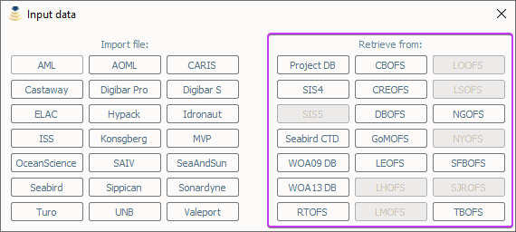
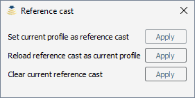

.. _additional_functionalities:

**************************
Additional Functionalities
**************************

Retrieve Profiles from Various Sources
======================================

.. index:: profile, synthetic profile

It is possible to retrieve a profile from a number of sources. This can be done by
selecting one of the options listed under *Retrieve from* in the *Input data* dialog (:numref:`editor_tab12`). Database
specific instructions for creating a profile are detailed in the sections below.

.. _editor_tab12:

    The *Input data* button in the *Editor* toolbar.

Project Database
----------------
The *Input data* dialog can be used to recall a profile from the project database. Clicking the *Project DB* button will
open a dialog with a drop-down menu containing all the profiles in the current project database. After selecting a
profile, it can be edited, and the resulting cast can be eventually sent as described in :ref:`data_transmission`.

Request profile from SIS4/SIS5
------------------------------

.. index:: SIS, profile

The *Input data* in the *Editor* toolbar can also be used to retrieve the cast currently being used by *SIS* and
use it to create a new profile.

This is only possible if the package is receiving data transmissions from *SIS*.
If it is not, the package will request a cast and will wait a few seconds until it times out on the request.
During this wait period, the package will be unresponsive to further user interaction.

If a profile is received, it will be given the name ``YYYYMMDD_HHMMSS_SIS`` with the date/time in the filename
based on the cast time recorded by *SIS*.

There are a number of shortcomings regarding the Kongsberg datagram format for sound speed profiles:

* It does not preserve the latitude/longitude of the observed cast. You will be prompted to enter the position of the cast when you request the cast from SIS. It is up to you to determine the position as accurately as you require it to be, perhaps by consulting CTD/XBT logs.
* The observation time associated with the cast is known to be incorrect in the *SIS* sound speed profile datagram format so it is not necessarily straightforward to use the observation time to look up the navigation.
* Temperature and salinity are not included in the datagram, even if they are provided to *SIS* when the associated cast was originally uploaded (they are preserved internally in SIS, however).

These shortcomings are overcome through the use of the “W” datagram in *SIS*, however, it is not currently possible
to dynamically request this datagram from *SIS* (though it is possible to have *SIS* broadcast it
as discussed in the section :ref:`method_B`).

Seabird CTD
-----------
Clicking Seabird CTD in the *Retrieve from* section of the *Input data* dialog opens a dialog that allows for direct
interaction with a SeaCAT instrument.

Oceanographic and Regional Atlases
----------------------------------

.. index:: WOA, synthetic profile
.. index:: RTOFS, synthetic profile
.. index:: RegOFS, synthetic profile

It is possible to upload a single WOA, RTOFS, or any of the supported RegOFS models listed in :ref:`app_a_oceanographic_atlases`.
This can be done by selecting the button under *Request from* that matches the desired model service.

This will trigger a series of question dialogs about timestamp and position to apply a spatio-temporal search.
The user can decide to use the SIS timestamp/position input (when available) or manually set these inputs.
After, a surface sound speed can be applied, and finally the resulting cast can be sent as described in :ref:`data_transmission`.

The new cast will be given the filename YYYYMMDD_HHMMSS_MODEL where the date/time
of the filename is based on the query time of the cast and MODEL corresponds to the model descriptor described in :ref:`app_a_oceanographic_atlases`.

Using a reference cast
======================

There are several scenarios where a CTD profile can be used as a reference cast by this package:

* To support XBT measurements by providing a salinity profile measurement in place of using an assumed constant salinity
* To augment SVP/XSV casts with temperature and salinity profiles to improve seafloor backscatter attenuation corrections
* Since CTD casts typically sample much deeper than most XBT probes, to provide an improved vertical extrapolation to the XBT cast.

To establish a reference cast, the desired cast is imported using the same mechanism described in :ref:`data_import`.
After that the profile is verified, edited and perhaps extended further in depth using an oceanographic database,
it is set as the reference profile by selecting "Reference cast" in the *Editor* toolbar (:numref:`editor_tab13`).

.. _editor_tab13:
.. figure:: ./_static/editor_tab13.png
    :width: 640px
    :align: center
    :alt: data storage
    :figclass: align-center

    The *Reference cast* button in the *Editor* toolbar.

Once a profile is set as the reference cast, the reference profile is drawn in orange.
This cast is retained in memory as the currently loaded cast to allow for additional operations,
such as exporting or transmission to a sounder. The reference profile can be cleared from memory at any time
via the *Clear reference cast* option under the *Reference cast* menu (:numref:`editor_tab14`).
Further extensions and augmentations will then use WOA/RTOFS.

.. _editor_tab14:

    The *Reference cast* tool.

The reference cast can be reimported into memory by choosing *Reload reference cast as current profile* from the *Reference cast* menu.
This will load a copy of the reference cast into memory for further manipulation.
If desired, the edited version can then be set as the new reference cast and will replace the previous version.
Prior to setting a cast as the reference cast, it is advisable to store it in database such that future sessions
do not need to repeat any reference cast processing.

Statusbar information
=====================

.. index:: statusbar

SSM shows handy information on the statusbar like the active sources (e.g., W23 for WOA23) and data from the listeners
(e.g. navigation from SIS5).

Furthermore, SSM statusbar shows different colors to capture user attention in case of issues (e.g., ‘Not pinging for a
while’ alert). :numref:`statusbar_colors` summarizes the possible statuses shown in the SSM taskbar.

.. _statusbar_colors:

    The possible statuses shown in the SSM taskbar.

Network data reception
======================

The package is configurable to listen on specified ports for UDP input of sound speed cast data.
Currently supported systems are *MVP* and *Sippican*. See :ref:`app_b_connection_settings` for more on how
to configure these systems. The port numbers associated with various data sources can be changed
in the ``setup.db`` file using the *Setup* tab.

Upon reception of a network cast, the display panels will be colored red to indicate that operator intervention
is required in order to further process the data and deliver it to the multibeam acquisition system.
Once the cast has been processed and delivered, the statusbar color-coding will return to the normal background.

If the *Server mode* happened to have been running at the moment of reception, it will be stopped and
the received cast will be displayed as described above.
