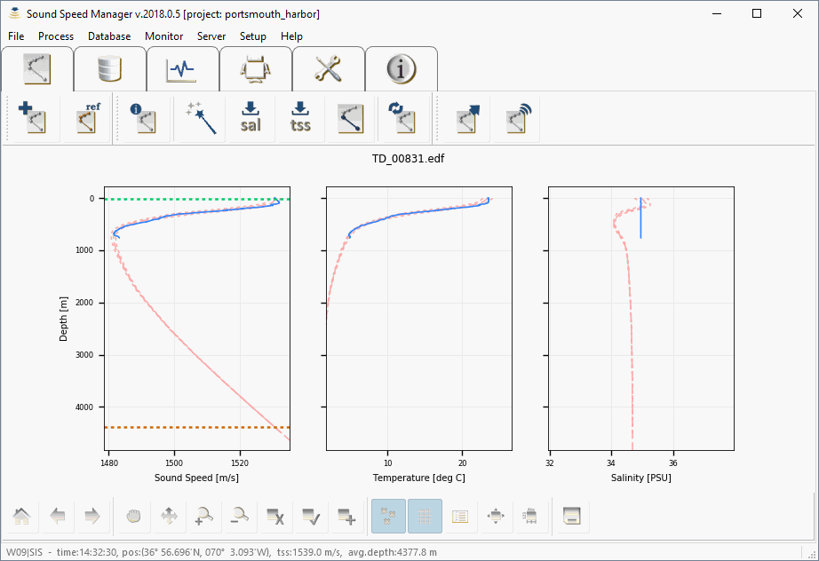
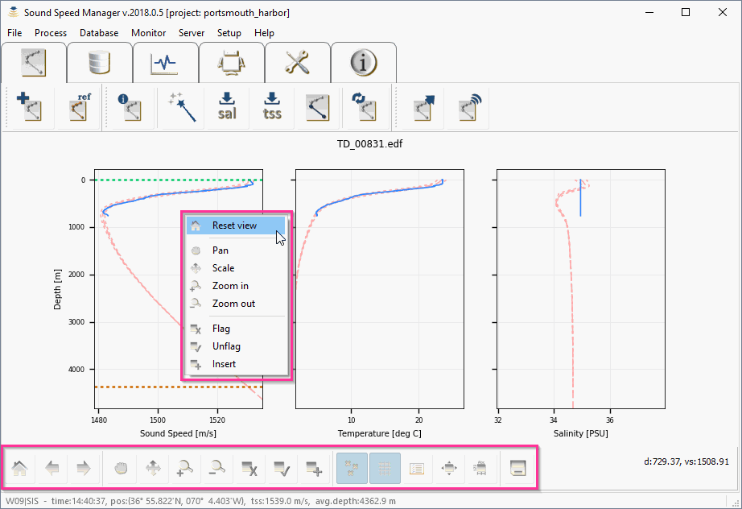
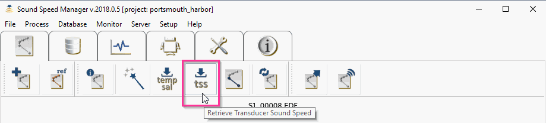
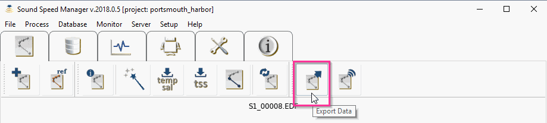
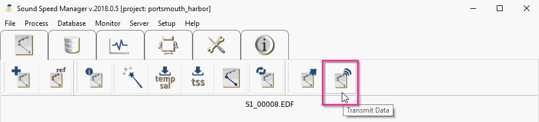

.. _data_editor_tab:

***************
Data Editor Tab
***************

.. index::
   single: tab; data editor

.. _data_import:

Data import
===========

.. index::
   single: data; import

From the *Editor* tab, select *Import data* (:numref:`editor_tab0`) and choose the desired import file type (:numref:`editor_tab1`).

.. _editor_tab0:
.. figure:: ./_static/editor_tab0.png
    :width: 640px
    :align: center
    :alt: alternate text
    :figclass: align-center

    Click on the *Import data* button in the *Editor* tab to start the import process.

.. _editor_tab1:
.. figure:: ./_static/editor_tab1.png
    :width: 400px
    :align: center
    :alt: alternate text
    :figclass: align-center

    Click on the desired import file type.

This will launch a file selection dialog (:numref:`editor_tab2`) with the expected file extension set as a filter, e.g. ``.edf``
for *Sippican* files.

.. _editor_tab2:
.. figure:: ./_static/editor_tab2.png
    :width: 500px
    :align: center
    :alt: alternate text
    :figclass: align-center

    Browse to the desired data file.

.. note:: A number of sample data files can be downloaded from the `data <https://github.com/hydroffice/hyo_soundspeed/tree/master/data/input>`_ folder in the project repository.

After the selection of the desired file, the window shows panels with the sound speed, temperature and
salinity profiles drawn in solid blue (left to right, respectively, in :numref:`editor_tab3`).

.. _editor_tab3:

    *Sound Speed Manager* showing the three main plots: sound speed, temperature, and salinity.

During the import stage, the geographic position and date in the input file are used to query WOA or RTOFS
atlases (if available) to obtain mean sound speed, temperature and salinity profiles (to provide a context
during data editing), which are drawn in dashed colours. Thus, it is important that the cast positional metadata
are correct for this lookup operation.

Furthemore, the position is also required by some formats to compute the pressure to depth conversion (since this
has a latitudinal dependence). Since some file formats do not support recording of geographic position
(e.g., *Valeport* ``.000``) the user must enter these manually during import (if the SIS position datagram is
not available).

All the available processing steps can be accessed from the *Process* menu. A selection of these steps is
present in the toolbar for ease their access in operation. This selection can be customized through the *Button Visibility* dialog
(:numref:`buttons_visibility`) accessible using *Process/Change Buttons Visiblity*.

.. _buttons_visibility:

    The *Button Visibility* dialog.

Interactive data editing
========================

The mouse interactive mode is set using the plotting toolbar at the bottom (:numref:`editor_tab4`) or by directly right-clicking
on the plots once a cast is loaded. Currently available inspection modes are:

* *Reset view*: to visualize the full profile
* *Pan*: to move the area visualized in the plot
* *Scale*: to modify the horizontal and vertical scales of the plots
* *Zoom in*: to zoom in to a selected area
* *Zoom out*: to zoom out from a selected area
* *Flag*: mark spurious measurements for removal from any plot panel through a left-click drag motion over the bad data points. The flagged points will be drawn in red.
* *Unflag*: reclaiming previously flagged data, using the same left-click and drag motion as *Flag*.
* *Insert*: manually adding points to the profiles can be useful to create a more realistic cast extension. This is particularly useful when the measured temperature and/or salinity values deviate from WOA/RTOFS or the reference profile near the bottom of the profile.

Zooming back out to the full view is accomplished by choosing *Reset view* from the plotting toolbar
(or by directly right-clicking on the plot and selecting *Reset view*).
The *Hide flagged* option in the plotting toolbar will toggle the display of flagged points.

.. _editor_tab4:

    Interactive data editing of a loaded profile.

Metadata editing
================

Several information related to the cast are collected during the import and the processing of a cast.
Metadata can be viewed by clicking the *Metadata* button on the tool bar (:numref:`metadata_button`).

.. _metadata_button:
.. figure:: ./_static/metadata_button.png
    :width: 640px
    :align: center
    :alt: data editing
    :figclass: align-center

    Button to access the *Metadata* widget.

It is also possible to manually edit several of the metadata entries (:numref:`metadata_widget`) and to force the
visualization of the *Profile metadata* tool at the import time (:numref:`metadata_at_import`).

.. _metadata_widget:

    The *Profile metadata* tool.

.. _metadata_at_import:

    When the "Show at Import" button is flagged like in the figure, the *Profile metadata* tool is automatically displayed when a new profile is imported.

Data filtering/smoothing
========================

If required, the profile data can be automatically filtered and smoothed using the *Filter/Smooth Data* button (:numref:`editor_tab5`).

.. _editor_tab5:
.. figure:: ./_static/editor_tab5.png
    :width: 640px
    :align: center
    :alt: data editing
    :figclass: align-center

    The *Filter/Smooth Data* button in the *Editor* toolbar.

Data augmentation
=================

Sound speed data can be augmented with WOA/RTOFS/reference salinity and/or temperature. If a reference cast has been set,
then the reference cast will be used to augment salinity and/or temperature profiles instead of the WOA/RTOFS profiles.

XBT probes
----------

.. index:: XBT

XBT probes measure the temperature of water as they drop to the seafloor. Since the speed of sound in water is
strongly affected by water temperature, this measurement can be used to estimate the sound speed profile.
Since salinity can also influence the speed of sound in water, the accuracy of the sound speed estimate
can be improved through better approximation of the water’s salinity. This approximation can be as simple as
assuming that the salinity is constant over all depths or it could be as sophisticated as using
an independent salinity depth profile from an alternate sensor such as a CTD or perhaps from an oceanographic model.

The package follows this second approach. The salinity profile is specified by selecting *Retrieve salinity*
(:numref:`editor_tab6`) from the *Editor* toolbar (the option is only active when an XBT cast is loaded). With this command,
the dashed WOA or RTOFS salinity profile is used to augment the XBT temperature measurement.
Since the vertical resolution of the WOA/RTOFS grids is coarse compared to the typical sampling interval
of the measured data, the salinity estimates are linearly interpolated to the depths associated
with each of the temperature observations in the measured XBT profile.

.. _editor_tab6:
.. figure:: ./_static/editor_tab6.png
    :width: 640px
    :align: center
    :alt: data editing
    :figclass: align-center

    The *Retrieve salinity* button in the *Editor* toolbar.

The salinity plot (right-most of the three panels) will update with a salinity profile and sound speed plot
(the left-most panel) are updated with sound speed (recalculated using the new salinity estimates).
Sound speed values are calculated using the UNESCO equation (*Fofonoff and Millard, 1983*).

XSV probes
----------

.. index:: XSV

In the case of an XSV file, the user can decide to augment the measured sound speed with WOA/RTOFS temperature and
salinity through the XSV load temperature/salinity option under the *Process* menu (:numref:`editor_tab7`).
The option is only active when an XSV cast is loaded.

.. _editor_tab7:
.. figure:: ./_static/editor_tab7.png
    :width: 640px
    :align: center
    :alt: data editing
    :figclass: align-center

    The *Retrieve temperature/salinity* button in the *Editor* toolbar.

.. note:: In this mode, the sound speed is NOT recalculated, the temperature and salinity are meant merely for SIS
    to compute transmission loss corrections for improved backscatter normalization.
    Thus, the application disallows the *Retrieve salinity* button in the *Editor* toolbar for XSV profiles.

Manual user insertions
----------------------

.. index:: manual insertion

There are two methods to add points, after having selected the *Insert* mode in the right-click menu or in the plotting
toolbar:

1. *Adding sound speed points in the sound speed plot.* This method adds points to the sound speed profile only and it holds the last observed temperature and salinity constant (i.e., it makes no attempt to update the temperature/salinity profiles for the chosen sound speed). Thus, this method is well suited for output formats or transmission protocols in which the temperature/salinity values are not used.

2. *Adding salinity and temperature points.* This method adds salinity and temperature points in their respective plots and then calculates the resulting sound speed based on the temperature/salinity plots. A first click in the salinity plot adds a salinity point. Then, a second click is required in the temperature profile (the depth of the first point in the salinity plot will be adjusted to match the depth of the second click). Finally, a third click in the sound speed plot computes the new sound speed point based on the previously selected depth/temperature/salinity values (the depth from the last click in the sound speed plot is NOT used, i.e., you can click anywhere in the sound speed plot).

Multipoint extensions are achieved through repeating the above sequence. If a deep extension that exceeds
the view limits is required, repeatedly clicking near the bottom of the plots will automatically adjust the view bounds.

Applying surface sound speed
----------------------------

If configured to receive data from SIS, the surface sound speed and transducer draft from the depth datagram broadcast
can be used to create a surface layer of thickness equal to the transducer draft and of sound speed equal
to the value used in beam forming (this is based on the assuption that the value comes
from the surface sound speed probe).
This operation can be achieved by selecting *Retrieve Surface Sound Speed* from the *Editor* toolbar
(:numref:`editor_tab8`).

.. _editor_tab8:

    The *Retrieve Surface Sound Speed* button in the *Editor* toolbar.

If neither the surface sound speed or transducer draft values are available from a SIS data broadcast,
the software will prompt the user to input values for both.

The intent of this feature is to keep the sound speed profile and sound speed sensor values similar such that
the numerical display monitors in SIS do not warn against sound speed discrepancies between the two measurements.
It should be noted that this is done internally in SIS during their ray tracing operations,
regardless of this external processing stage: “transducer depth sound speed is used as the initial entry
in the sound speed profile used in the ray tracing calculations” (*Kongsberg, 2012*).

Using this package method, keeps the system from warning against discrepancies based on:

* The uncertainty in XBT temperature measurements (± 0.1°C, roughly equivalent to ± 0.4 m/s)
* Inadequate choice of salinity in the Sippican acquisition system
* Deviations of true salinity from the mean surface salinity in the WOA/RTOFS.

Profile extension using WOA/RTOFS atlases or a reference cast
-------------------------------------------------------------

.. index:: WOA; extension
.. index:: RTOFS; extension

Profile extension can be applied by selecting *Extend profile* from the *Editor* toolbar (:numref:`editor_tab9`).
This operation will extend the observed cast in depth as much as possible using the WOA/RTOFS profile.
After that, the three plot panels will be updated. If necessary, users should edit any discontinuities
between the cast in depth and the extension in the vicinity of the maximum observation depth.

The extension will only go as deep as 5,500 m as this is the deepest depth layer that the WOA/RTOFS atlases support
(more details on such an operation are provided in :ref:`app_a_oceanographic_atlases`).

However, when files are transmitted to *SIS* or exported in ``.asvp`` format, the software extends the profile
to 12,000 m depth to meet *SIS* input criteria (thus, there is no need for the user do this manually).
Similar to data augmentation for XBT probes and for XSV probes, when a reference cast is set,
this will be used to extend the cast instead of WOA/RTOFS atlases data.

.. _editor_tab9:
.. figure:: ./_static/editor_tab9.png
    :width: 640px
    :align: center
    :alt: extend profile
    :figclass: align-center

    The *Extend profile* button in the *Editor* toolbar.

Automated processing
--------------------

To streamline the processing of new sound speed profiles, it is also possible to automate a number of steps
in the workflow. The *Automated Processing Setup* dialog (:numref:`automated_processing`) can be accessed
under *Process/Automate Processing*.

.. _automated_processing:
.. figure:: ./_static/automated_processing.png
    :width: 320px
    :align: center
    :alt: automated processing
    :figclass: align-center

    The *Automated Processing Setup* dialog.

Output creation
===============

Data export
-----------

.. index:: data; export

Any file that is loaded into the package can be exported by accessing the *Export data* from the *Editor* toolbar
(:numref:`editor_tab10`).

.. _editor_tab10:

    The *Export data* button in the *Editor* toolbar.

Several formats are currently supported, so the user must select the format of interest and
then choose *Export selected formats* to actually perform the export.

The export function will prompt the user for an output prefix prior to export.

.. _data_transmission:

Data transmission
-----------------

.. index:: data; transmission
.. index:: SIS

Data transmission is triggered by selecting the *Transmit data* from the *Editor* toolbar (:numref:`editor_tab11`).

.. _editor_tab11:

    The *Transmit data* button in the *Editor* toolbar.

The recipients of such a transmission are configured in the configuration file (see :ref:`package_configuration`).
Given that the profile accepted by *SIS* often requires the application of a thinning algorithm,
a method *Preview thinning* is provided to inspect the result of such an algorithm before the actual transmission.

Data storage
------------

.. index:: database

Each time that a profile is exported or transmitted, it is also automatically stored in the current active database.

It is also possible to force the storage of a profile using *Process/Save to Database*.
