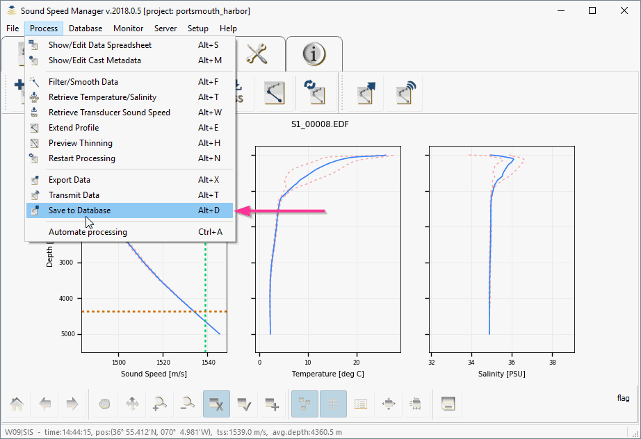
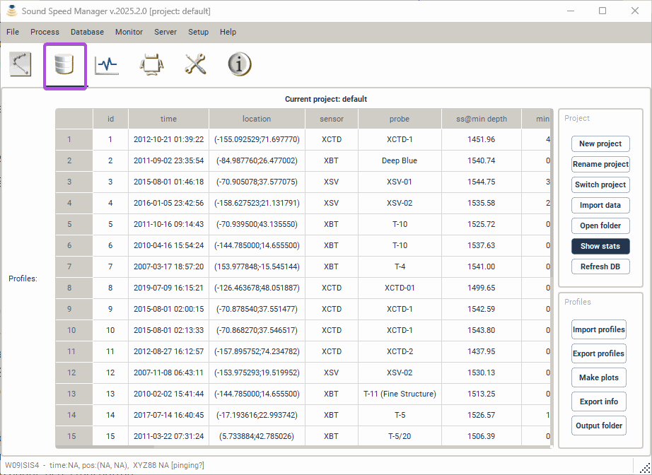
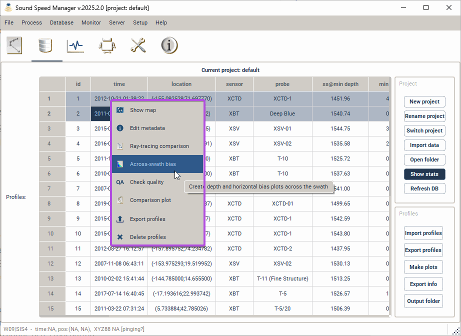
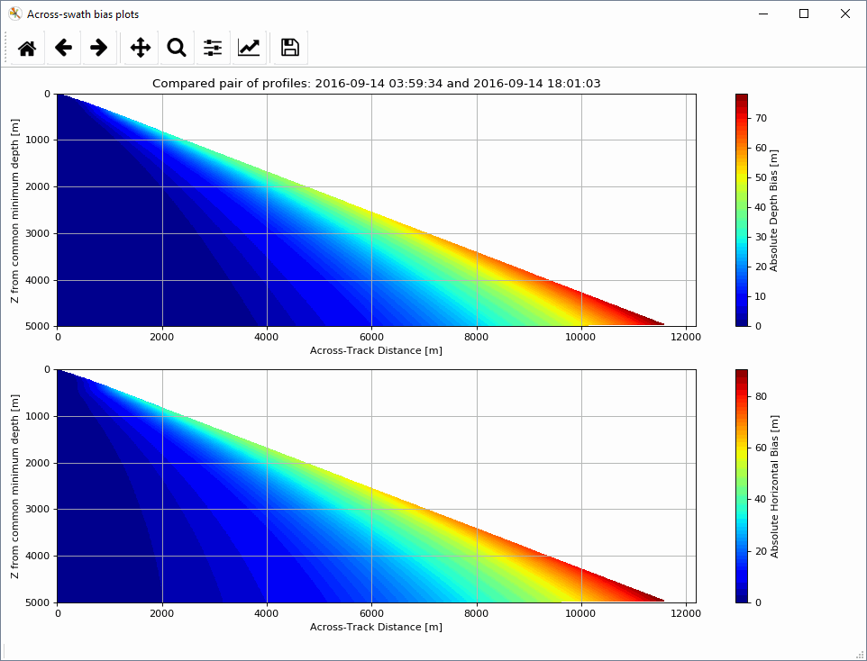
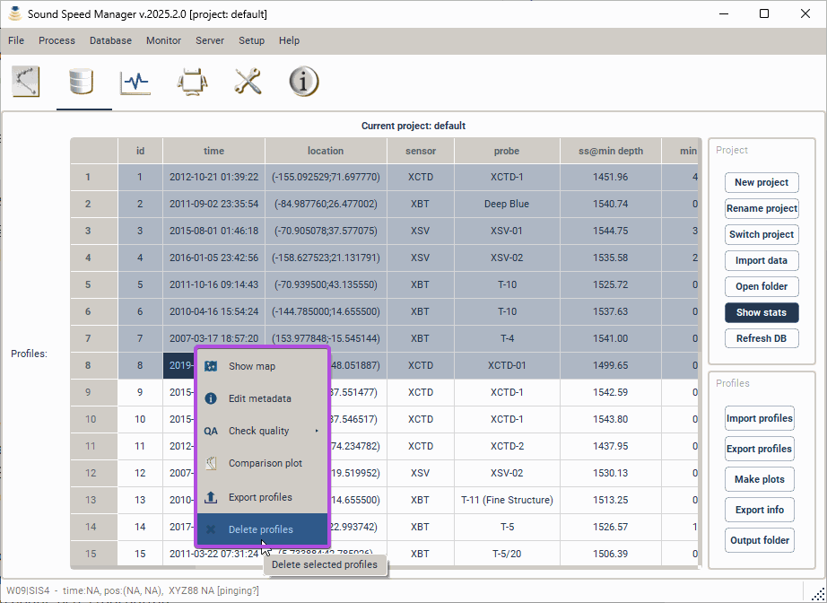
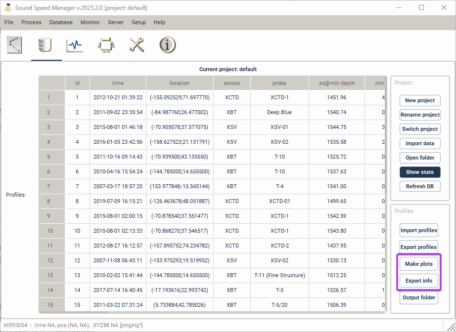
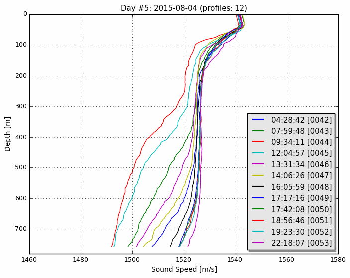

.. _database_tab:

************
Database Tab
************

.. index::
   single: tab; database

.. index:: database

The package provides functionalities to permanently store, delete and retrieve the sound speed profiles.
Any time that a profile is exported or transmitted, its data content is stored in the database.
A profile can also be stored in the database by using *Save to database* in the *Editor* toolbar (:numref:`save_to_database`).

.. _save_to_database:

    The *Save to database* menu entry in the *Process* menu.

In particular, each profile contains three types of stored data:

1. The raw data (which makes it possible to redo the processing from scratch).
2. The processed samples (with flags to identify the different sources of data).
3. An optional SIS profile (that represents the result of the thinning process required by *Kongsberg SIS*).

Once stored in the database, the *Database* tab provides analysis functions and tools to manage the collected profiles (:numref:`database_tab0`).

.. _database_tab0:

    The *Database* tab provides access to the collected profiles and related tools.

Context menu
------------

The context menu provides access to different tools based on the number of selected profiles:

* Single-profile selection (:numref:`database_single_selection`).
* Pair-profile selection (:numref:`database_pair_selection`).
* Multi-profile selection (:numref:`database_multi_selection`).

.. _database_single_selection:
.. figure:: ./_static/database_single_selection.png
    :width: 640px
    :align: center
    :alt: single selection
    :figclass: align-center

    The single-selection context menu provides functionalities specific to a single profile.

.. _database_pair_selection:

    The pair-selection context menu provides functionalities like ray-tracing comparison (:numref:`ray_tracing_comparison`) and bias plots (:numref:`bias_plots`).

.. _ray_tracing_comparison:

    The ray-tracing comparison between the pair of selected profiles.

.. _bias_plots:

    The plots show the vertical and the horizontal bias using the pair of selected profiles.

.. _database_multi_selection:

    The multi-selection context menu provides functionalities that apply to multiple profiles (e.g., editing common metadata fields for multiple profiles).

Project and Profiles groups
---------------------------

The *Project* group provides functionalaties to:

* Create a new project (*New project* button).

* Rename an existing project (*Rename project* button).

* Switch among existing projects (*Switch project* button).

* Import data from an existing database to the current project (*Import data* button).

* Open the folder that contains the project databases (*Open folder* button).

From the *Profiles* group, it is possible to import (*Import profiles* button) or export (*Export profiles* button) multiple profiles.

Using the *Make plots* and *Export info* buttons (:numref:`database_make_plots`), you may:

* Export the profile metadata in several geographic formats: csv, kml, shapefile (e.g., :numref:`kml_export_fig`), and

* Create maps (:numref:`map_creation_fig`) and plots (:numref:`daily_plot_fig` and :numref:`aggregate_plot_fig`).

.. _database_make_plots:

    The *Make plots* and *Export info* buttons in the *Profiles* group creates plots/maps and exports the metadata for all the profiles in the database.

.. index:: csv
.. index:: kml
.. index:: shapefile

.. _kml_export_fig:

.. figure:: ./_static/kml_export.png
    :width: 600px
    :align: center
    :alt: alternate text
    :figclass: align-center

    Loading result of the exported metadata (kml format) in Google Earth.

.. _map_creation_fig:

.. figure:: ./_static/map_creation.png
    :width: 600px
    :align: center
    :alt: alternate text
    :figclass: align-center

    Example of a map created from a stored SSP data set.

.. _daily_plot_fig:

    Example of a daily plot that can be created from a stored SSP data set.

.. _aggregate_plot_fig:

    Example of aggregate plot to study the sound speed variability during a selected time span.
