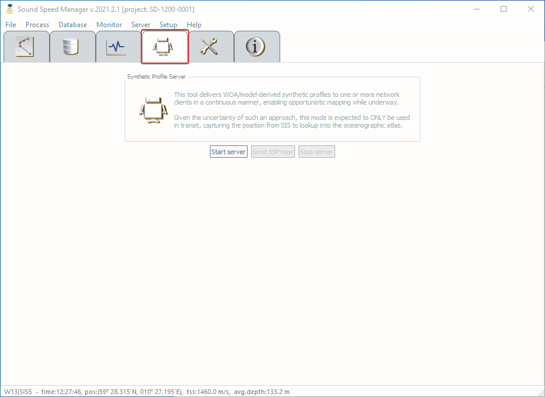

.. _server_mode:

*****************************
Synthetic Profile Server Mode
*****************************

.. index::
   single: mode; server

The *Synthetic Profile Server mode* is meant for transits during which perhaps one XBT per day might be thrown.
For much of the world oceans, using the WOA is a reasonable substitute for *in situ* measurements
(*Beaudoin et al., 2011*).

Given that transit data are usually a lower priority, this mode supports continuous underway logging of multibeam data
that are refraction corrected, using the mean temperature and salinity profiles provided by oceanographic models.
This mode should not be used if SSPs are going to be collected on a regular basis.

.. _server_tab0:

    The *Synthetic Profile Server* tab provides the controls to manage the *Server* mode.

A preliminary requirement to run the *Server Mode* is that position and surface sound speed are received from *SIS*.
This can be checked by looking in the status bar.

When this mode is active, all the user’s manual functionalities becomes unavailable until the *Server mode* is stopped.
The last sent profile is displayed in the view panel and all three plot panels are colored green.
The mode can be stopped by selecting *Stop* under the *Server* menu (:numref:`server_tab0`). Closing the application will also stop the server.
To guard against accidentally overwriting a profile that was uploaded by the operator after the server was started,
this mode verifies with SIS that nothing has been uploaded since the last synthetic cast was delivered.

If the package finds that a profile has been uploaded, either by another program or a person, it will stop serving
WOA data to SIS and will notify the user.

Serving to multiple clients
===========================

.. index:: mode; clients

For installations with multiple clients, the server will deliver the cast sequentially to all clients.
Failure on transmission to one client will not interfere with other clients.
Once a client is deemed “dead”, i.e., no reception confirmation is received, no further attempts to send
to the client are made even if a “dead” client comes back to life (a restart is required).
If all clients are deemed dead, then the server stops and notifies the user.

.. note:: *SIS* will accept and rebroadcast SVP datagrams even if it is not pinging. Thus, to make a client appearing “dead” to the server, you must shutdown *SIS*.

