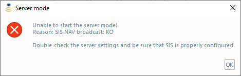

.. _server_mode:

*****************************
Synthetic Profile Server Mode
*****************************

.. index::
   single: mode; server

The *Synthetic Profile Server mode* is meant for transits during which perhaps one XBT per day might be thrown.
For much of the world oceans, using the WOA is a reasonable substitute for *in situ* measurements
(*Beaudoin et al., 2011*).

Given that transit data are usually a lower priority, this mode supports continuous underway logging of multibeam data
that are refraction corrected, using the mean temperature and salinity profiles provided by oceanographic models.
This mode should not be used if SSPs are going to be collected on a regular basis.

.. warning:: The Server Mode is meant for use in transit, NOT for systematic seabed mapping.

.. _server_tab0:
.. figure:: ./_static/server_tab0.png
    :width: 600px
    :align: center
    :height: 460px
    :alt: server tab
    :figclass: align-center

    The *Synthetic Profile Server* tab provides the controls to manage the *Server* mode.

Setup
=====

To run the *Server Mode*, it is required to have properly set the two-way interaction with *SIS* (both receiving and
transmitting specific datagrams).
Based on the SIS version in use, follow the instructions in :ref:`ssm_sis4` or :ref:`ssm_sis5`.

.. note::
   When the *SIS* interaction is properly set, the status bar updates with information like the position (*'pos:'*) and
   the transducer sound speed (*'tss:'*).

The *Setup* tab has the following *Server settings* options that specifically apply to the *Server Mode*:

* *Source*. It defines the source used to retrieve the synthetic profile.
* *Surface sound speed*. If true, the received transducer sound speed is used to enhance the transmitted synthetic profile.

When clicking on the "Start server" button and in case that unidirectional clients (e.g., QINSy) are present,
the user is prompted to decide whether or not transmitting the profiles to them.
Given that no acknowledgment is received, *SSM* cannot automatically verify the profile transmission.

Each time that the *Server Mode* is started, a few initialization checks are performed:

* The selected *Source* being currently in use.
* The reception of navigation and depth datagrams from SIS.
* Only for SIS clients, the interaction with them (by requesting the sound speed profile in use).

.. note:: *SIS* will accept and rebroadcast SVP datagrams even if it is not pinging. Thus, to make a client appearing “dead” to the server, you must shutdown *SIS*.

If any of these checks fails, an error message is displayed (:numref:`server_checks_error`).

.. _server_checks_error:

    An example of error message after the failure of one of the initialization checks for the *Server Mode*.

How to use
==========

The *Server Mode* is activated by clicking on the "Start server" button (:numref:`server_tab0`).

.. note::
   When the *Server Mode* is active, all the other SSM functionalities becomes unavailable until it is stopped.

During the *Server Mode*:

* The last transmitted profile is displayed in the view panel.
* The status bar is colored in cyan.

While activated, the *Server Mode* evaluate the need for transmitting a new synthetic profile every 60 seconds.

The evaluation is done following these steps:

* The latest location (with associated timestamp) is retrieved from SIS.
  If a new navigation datagram is not available, the retrieval is attempted several times for a total time of 60 seconds.
  In case that such an amount of time is not sufficient, the *Server Mode* is automatically stopped.
* Based on the retrieved information and the selected source, the indices for retrieving the synthetic profile
  are calculated. If the location is out of the coverage for the selected source, the *Server Mode* is NOT
  stopped because the vessel may later enter the area covered by the selected source.
* If the 'Surface sound speed' option is active, an attempt to retrieve the surface sound speed from SIS is performed.
* The transmission of a new synthetic profile is decided in case of:

  * A variation of transducer sound speed greater than 1 m/s.
  * A change of source indices given by the vessel navigation.
  * The user have clicked the 'Send SSP now' button.

* To guard against accidentally overwriting a profile uploaded by the operator (or by another program) directly into SIS,
  the *Server Mode* compares the SSP currently on *SIS* against the latest two transmitted synthetic SSP. This **cannot**
  happen in case on unidirectional clients (e.g., QINSy).

.. note::
   In case that the SIS and the transmitted profiles differ, the *Server Mode* automatically stops.

* If a new transmission is decided, the synthetic profile is generated.

.. index:: mode; clients

In case of multiple clients, the *Server Mode* delivers the cast sequentially to all clients.
Failure on transmission to one client will not interfere with other clients.

Once a SIS-based client is deemed “dead”, i.e., no reception confirmation is received, no further attempts to send
to the client are made. Thus, in case that a “dead” SIS-based client comes back to life, a *Server Mode* restart is required.

.. note::
   If the *Server Mode* is unable to confirm clients, the *Server Mode* automatically stops.

The *Server Mode* can be manually stopped by clicking the *Stop server* button (:numref:`server_tab0`).
Closing SSM will also stop the server.
