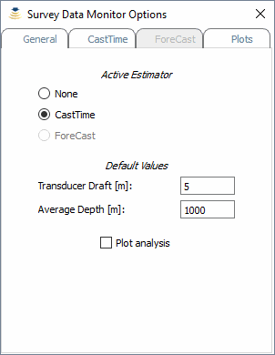
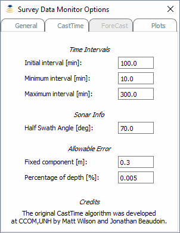
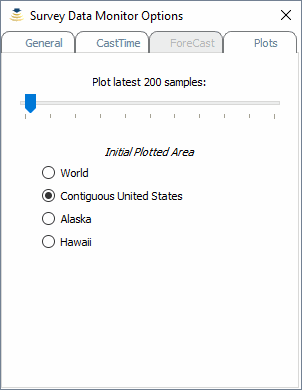
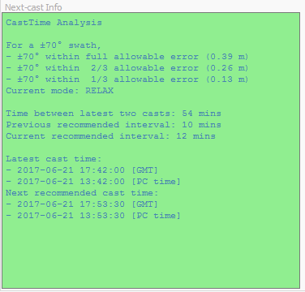

.. _data_monitor_tool:

*******************
Survey Data Monitor
*******************

.. index:: monitor

The *Survey Data Monitor* (:numref:`data_monitor_tool_tab`) has two main functionalities:

* Monitoring the survey data being collected *(SIS required)*.
* Estimation of the time of the next cast (always available, but SIS information are used if present).

.. _data_monitor_tool_tab:
.. figure:: _static/monitor.png
    :align: center
    :alt: Survey Data Monitor tab

    Survey Data Monitor tab.

In Brief
========

The default configuration uses the *CastTime* algorithm to estimate the time suggested for the next cast.
*CastTime* analysis is based on the two latest casts from the Sound Speed Manager database (see :ref:`ssm_database`).

.. _data_monitor_plot_analysis:

    Example of analysis plot to display the error tolerance limits (in magenta on the right pane) used by CastTime
    to estimate the next cast time.

The background color in the *Next-cast Info* viewer (:numref:`data_monitor_tool_tab`) identifies
three possible estimation states (calculated in function of the maximum allowable error):

* *Steady* state (blue): the casting interval is the same as in the previous estimation.
* *Relax* state (green): the previous casting interval was increased.
* *Panic* state (red): the previous casting interval was reduced.

Independently by the current estimation state, the *Next-cast Info* viewer starts to blink when the suggested next-cast
time was reached, and there have not been newer casts stored in the database.

In the following sections, more details on how to use the *Survey Data Monitor* usage are provided.

.. _data_monitor:

Data Monitor toolbar
====================

The *Data Monitor* toolbar (:numref:`data_monitor_toolbar`) is used to start, pause, or stop the collection and
the analysis of the survey data.

When SIS interaction is active, additional data (i.e., dynamic transducer draft, sound speed at transducer, and
average depth across the sonar swath) are collected.

The collected monitoring data are stored in a survey database (.mon).

.. _data_monitor_toolbar:

    In red, the *Data Monitor* toolbar controls to start, pause, or stop the data monitoring.

The *Options* button in the *Data Monitor* toolbar (:numref:`data_monitor_toolbar`) provides access to the setup,
organized as follows:

* *General* tab (:numref:`data_monitor_option_general`).
* *CastTime* tab (:numref:`data_monitor_option_casttime`).
* *ForeCast* tab *(currently disabled)*.
* *Plots* tab (:numref:`data_monitor_option_plots`).

.. _data_monitor_option_general:

    In the *General* tab, you can select the estimator to be used *(ForeCast is currently disabled)*.
    You can also change the default values adopted by the estimator in case that SIS data are not available.
    When the *Plot analysis* flag is set, additional plots are visualized at the time of next-cast estimation.

.. _data_monitor_option_casttime:

    This tab contains the *CastTime*-specific settings: the initial casting interval, the possible range of variability
    for the estimated casting interval, the angle at which to calculate the ray-tracing, and the factors used in the
    formula used to calculate the maximum allowable error.

.. _data_monitor_option_plots:

    This tab is used to change the number of samples displayed in the plotters. This value does not affect the storing
    in the survey database (.mon).

.. note:: A high number of samples selected in the *Plots* tab (:numref:`data_monitor_option_plots`) may reduce the
    reactivity of Sound Speed Manager.

.. _data_manager:

Data Manager toolbar
====================

The *Data Manager* toolbar (:numref:`data_manager_toolbar`) provides functionalities to load previously collected data
as well as to export such data in a few geospatial formats (:numref:`data_manager_export`).

It is also possible to import Kongsberg EM Series (.all) files.

When a GeoTiff output is selected, the surface sound speed values in the collected data points are rasterized
in two kinds of files:

* Floating point GeoTiff, to be loaded in GIS applications (like QGis, Caris Hips&Sips, Esri ArcMap).
* Color-table Geotiff, supported by a large number of applications (e.g., Xylem HYPACK).

.. _data_manager_toolbar:
.. figure:: ./_static/monitor_toolbar_manager.png
    :align: center
    :alt: Data Manager toolbar
    :figclass: align-center

    In magenta, the *Data Manager* toolbar controls to open the output folder, to load data, and
    to export in various formats.

.. _data_manager_export:
.. figure:: ./_static/monitor_toolbar_manager_export.png
    :align: center
    :height: 180px
    :alt: Survey Data Export dialog
    :figclass: align-center

    The dialog shows the available export data formats.

.. _data_views:

Data Views toolbar
==================

The *Data Views* toolbar (:numref:`data_views_toolbar`) helps the user to customize the data visualization.

The *Survey Data Monitor* tool provides several plots and viewers that can be un-docked to ease their visualization
while performing other tasks with Sound Speed Manager:

* *General Info* viewer.
* *Surface Sound Speed Map* plotter.
* *Surface Sound Speed vs. Time* plotter.
* *Transducer Depth vs. Time* plotter.
* *Average Depth vs. Time* plotter.
* *Next-Cast Info* viewer.

Each plotter has a navigation toolbar that provides basic functionalities like panning and zooming.

.. _data_views_toolbar:
.. figure:: ./_static/monitor_toolbar_views.png
    :align: center
    :height: 100px
    :alt: Data Views toolbar
    :figclass: align-center

    In magenta, the *Data Views* toolbar controls to toggle the visualization of viewers and plotters.

The *Next-Cast Info* viewer (:numref:`next_cast_info`) displays textual information related to the latest analysis
performed by the next-cast estimator (e.g., *CastTime*).

.. _next_cast_info:

    The *Next-Cast Info* viewer provides information on the analysis performed by the *CastTime* algorithm.
