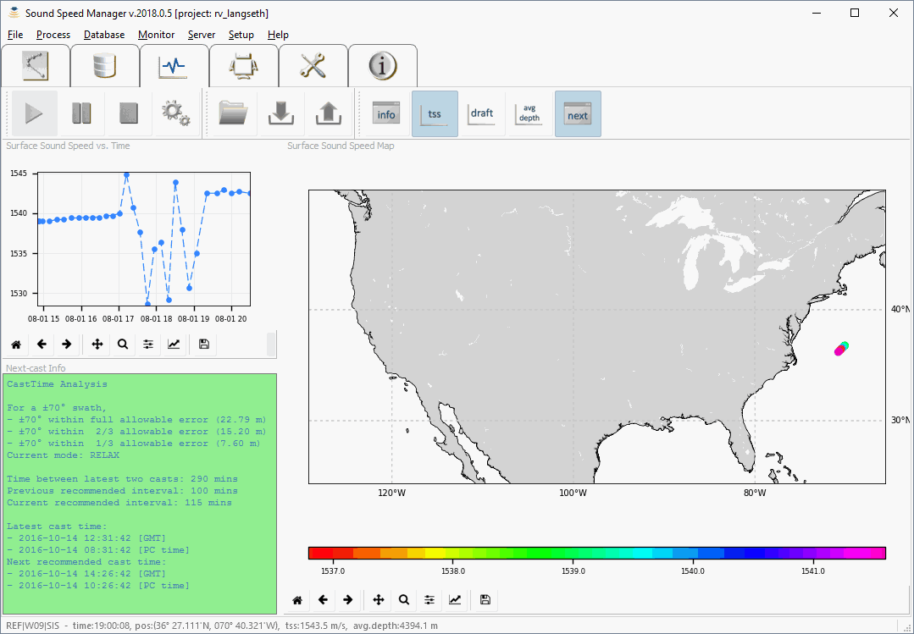
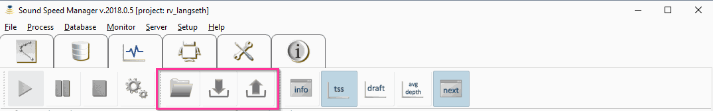

.. _data_monitor_tool:

*******************
Survey Data Monitor
*******************

.. index:: monitor

The *Survey Data Monitor* is a tool to monitor the data being collected and to facilitate the surveyor
in identifying possible issues (:numref:`data_monitor_tool_tab`).

.. _data_monitor_tool_tab:

    Survey Data Monitor tab.

The tool provides several plots and windows that can be undocked to ease their visualization while performing
other tasks with Sound Speed Manager:

* *Surface Sound Speed Map* plotter
* *Surface Sound Speed vs. Time* plotter
* *Transducer Depth vs. Time* plotter
* *Average Depth vs. Time* plotter
* *Textual Info* viewer

Each plotter has a navigation toolbar that provides basic functionalities like panning and zooming.

.. _data_monitor:

Data Monitor toolbar
====================

With SIS interaction active, the *Data Monitor* toolbar (:numref:`data_monitor_toolbar`) can be used to start, pause,
or stop the collection and the analysis of the survey data.

.. _data_monitor_toolbar:
.. figure:: ./_static/monitor_toolbar_monitor.png
    :align: center
    :height: 100px
    :alt: Data Monitor toolbar
    :figclass: align-center

    In magenta, the *Data Monitor* toolbar controls to start, pause, or stop the data monitoring.

The collected monitoring data are stored in a database (.mon).

.. _data_manager:

Data Manager toolbar
====================

The *Data Manager* toolbar (:numref:`data_manager_toolbar`) provides functionalities to load previously collected data
as well as to export such data in a few geospatial formats (:numref:`data_manager_export`).

It is also possible to import Kongsberg EM Series (.all) files.

When a GeoTiff output is selected, the surface sound speed values in the collected data points are rasterized
in two kinds of files:

* Floating point GeoTiff, to be loaded in GIS applications (like QGis, Caris Hips&Sips, Esri ArcMap).
* Color-table Geotiff, supported by a large number of applications (e.g., Xylem HYPACK).

.. _data_manager_toolbar:

    In magenta, the *Data Manager* toolbar controls to open the output folder, to load data, and
    to export in various formats.

.. _data_manager_export:

    The dialog shows the available export data formats.

.. _data_views:

Data Views toolbar
==================

The *Data Views* toolbar (:numref:`data_views_toolbar`) helps the user to customize the data visualization.

It is also possible to change the number of samples displayed (:numref:`data_views_option`).

.. _data_views_toolbar:

    In magenta, the *Data Views* toolbar controls to start, pause, or stop the data monitoring.

.. _data_views_option:
.. figure:: ./_static/monitor_toolbar_views_options.png
    :align: center
    :height: 100px
    :alt: Data Views Options dialog
    :figclass: align-center

    The dialog provides a slider to change the number of plotted samples.
