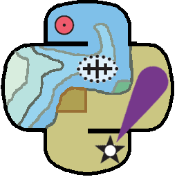

************
Installation
************

Installation using the Pydro distribution
=========================================

.. index:: Pydro

.. _pydro_logo:

    The Pydro logo.

If you are on Windows, you can easily install Sound Speed Manager as part of the `NOAA Office of Coast Survey Pydro <http://svn.pydro.noaa.gov/Docs/Pydro/_build_online/html/>`_ distribution.

Pydro is a suite of software tools used to support hydrography. It is (almost exclusively) built from open source components as well as public domain custom developed software. Pydro is maintained by Hydrographic Systems and Technology Branch (HSTB) to support NOAA operations (aiding Office of Coast Survey fleet) and is made available for public use.

You can download the latest Pydro installer from `here <http://svn.pydro.noaa.gov/Docs/Pydro/_build_online/html/downloads.html>`_.

Installation as stand-alone Python package
==========================================

If you decide to install the package in a Python environment, the dependencies are:

* `basemap <https://github.com/matplotlib/basemap>`_
* `gdal <https://github.com/OSGeo/gdal>`_
* `gsw <https://github.com/TEOS-10/python-gsw>`_ *(version == 3.0.6)*
* `matplotlib <https://github.com/matplotlib/matplotlib>`_
* `pillow <https://github.com/python-pillow/Pillow>`_
* `netCDF4 <https://github.com/Unidata/netcdf4-python>`_
* `numpy <https://github.com/numpy/numpy>`_
* `scipy <https://github.com/scipy/scipy>`_
* `pyproj <https://github.com/jswhit/pyproj>`_
* `pyserial <https://github.com/pyserial/pyserial>`_
* `PySide2 <https://github.com/pyside/pyside2-setup>`_ *(only for the application)*

If you want to install the last stable version (from PyPI):

* `pip install hyo2.soundspeed`

Or, if you prefer the bleeding edge code:

* `pip install https://github.com/hydroffice/hyo2_soundspeed/archive/master.zip`

Supplemental Data Space Requirements
====================================

.. index:: WOA; WOA09

Approximately 500 MB of additional disk space is required for the WOA09 db set optionally required
(but warmly suggested) by this hydro-package. If not available, the package will attempt to download it.

Alternatively, it is also possible to manually download, unpack the WOA09 data set at any path that SSM can have access to, and modify the configuration file
to point to the correct path (see :ref:`possible_configurations`).

By default, SSM looks for databases at:

* "C:/Documents and Settings/**<username>**/Application Data/HydrOffice/Sound Speed/atlases/**[woa09 or woa13]**" (Windows XP), or
* "C:/Users/**<username>**/AppData/Local/HydrOffice/Sound Speed/atlases/**[woa09 or woa13]**" (newer Windows OS)

.. index:: WOA; WOA13

Among other improvements, the WOA13 db provides a much better spatial resolution, but this comes with a much larger data size (~18 GB).

.. note:: If a previous version of the application was installed, *Sound Speed Manager* will try to localize past
    installations of WOA databases (WOA09 or WOA13).

