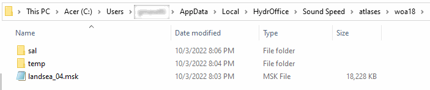
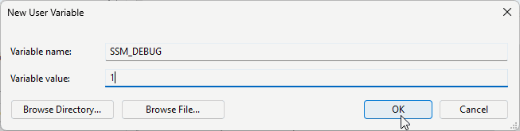

************
Installation
************

.. _pydro_installation:

Installation using the Pydro distribution
=========================================

.. index:: Pydro

.. _pydro_logo:

    The Pydro logo.

If you are on Windows, you can easily install Sound Speed Manager as part of the `NOAA Office of Coast Survey Pydro <http://svn.pydro.noaa.gov/Docs/Pydro/_build_online/html/>`_ distribution.

Pydro is a suite of software tools used to support hydrography. It is (almost exclusively) built from open source
components as well as public domain custom developed software. Pydro is maintained by Hydrographic Systems and
Technology Branch (HSTB) to support NOAA operations (aiding Office of Coast Survey fleet) and is made available for
public use.

You can download the latest Pydro installer from `here <http://svn.pydro.noaa.gov/Docs/Pydro/_build_online/html/downloads.html>`_.

Installation as stand-alone Python package
==========================================

If you decide to install the package in a Python environment, the dependencies are:

* `appdirs <https://github.com/ActiveState/appdirs>`_
* `cartopy <https://github.com/SciTools/cartopy>`_
* `gdal <https://github.com/OSGeo/gdal>`_
* `gsw <https://github.com/TEOS-10/python-gsw>`_
* `hyo2.abc2 <https://github.com/hydroffice/hyo2_abc2>`_
* `matplotlib <https://github.com/matplotlib/matplotlib>`_
* `netCDF4 <https://github.com/Unidata/netcdf4-python>`_
* `numpy <https://github.com/numpy/numpy>`_
* `pillow <https://github.com/python-pillow/Pillow>`_
* `pyproj <https://github.com/jswhit/pyproj>`_
* `pyserial <https://github.com/pyserial/pyserial>`_
* `PySide6 <https://github.com/qtproject/pyside-pyside-setup>`_ *(only for the application)*
* `qt-material <https://github.com/UN-GCPDS/qt-material>`_ *(only for the application)*
* `requests <https://github.com/psf/requests>`_
* `scipy <https://github.com/scipy/scipy>`_

If you want to install the last stable version (from PyPI):

* `pip install hyo2.ssm2`

Or, if you prefer the bleeding edge code:

* `pip install https://github.com/hydroffice/hyo2_soundspeed/archive/master.zip`

Supplemental Data Space Requirements
====================================

.. index:: WOA; WOA09

Approximately 500 MB of additional disk space is required for the WOA09 db set optionally required
(but warmly suggested) by this hydro-package. If not available, the package will attempt to download it.

.. index:: WOA; WOA13; WOA18; WOA23

Among other improvements, the WOA13, WOA18 and WOA23 dbs provide a much better spatial resolution, but this comes with a much
larger data size (~18 GB).

Alternatively, it is also possible to adopt a manual installation procedure:

* Manually download the zip files from https://www.hydroffice.org/soundspeed/.
* Unpack the atlas data sets at any path that SSM can have access to.
* Modify the configuration file to point to the correct root path (see :ref:`possible_configurations`).

By default, SSM looks for databases at:

* "C:/Documents and Settings/**<username>**/Application Data/HydrOffice/Sound Speed/atlases/**[woa09|woa13|woa18|woa23]**" (Windows XP), or
* "C:/Users/**<username>**/AppData/Local/HydrOffice/Sound Speed/atlases/**[woa09|woa13|woa18|woa23]**" (newer Windows OS)

.. _woa18_folders:

    The default location and internal structure of the WOA18 folder on recent Windows OS.

For the manual installation, when the atlas is composed of multiple zip files (e.g., WOA18), the file content needs to
be unzipped under the same folder (e.g., :numref:`data_monitor_tool_tab`).

.. note:: If a previous version of the application was installed, *Sound Speed Manager* will try to localize past
    installations of WOA databases (WOA09, WOA13, WOA18 and WOA23).

Troubleshooting
===============

.. index:: debug, troubleshooting, SSM_DEBUG

In case of issues, it may be useful to run SSM in *debug mode*.

On Windows, you can activate the debug mode by:

* Opening the environmental variables for your account in the *Control Panel*.
* Creating a *SSM_DEBUG* environment variable and assign *1* as value (e.g., :numref:`ssm_debug_creation`).
* Restarting SSM.

.. _ssm_debug_creation:

    Creation of *SSM_DEBUG* environmental variable on Windows *Control Panel*.
