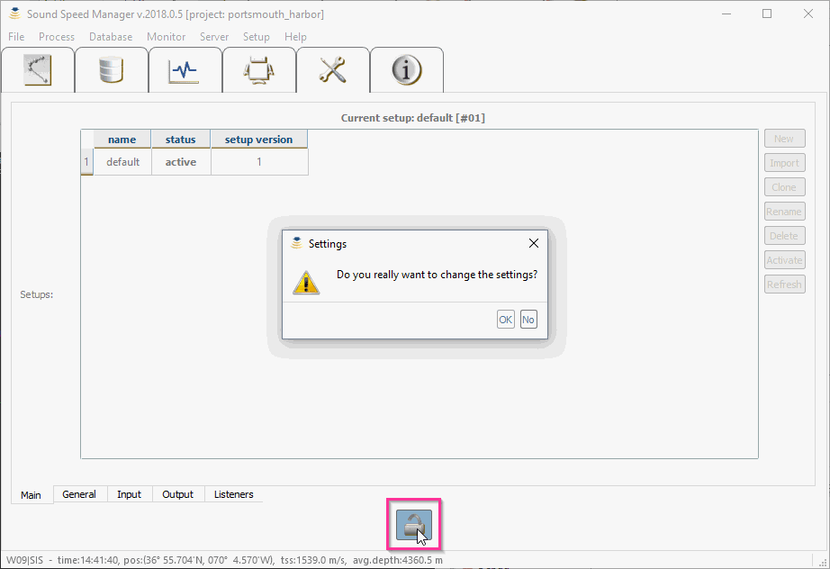
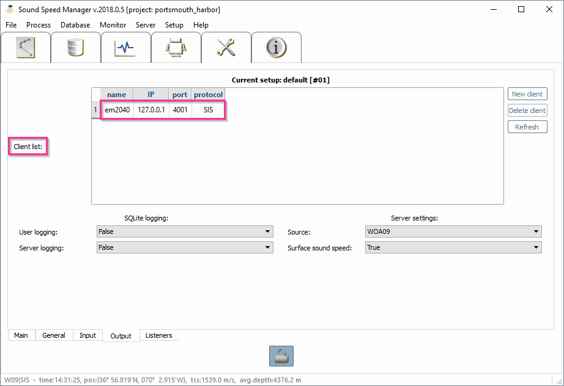
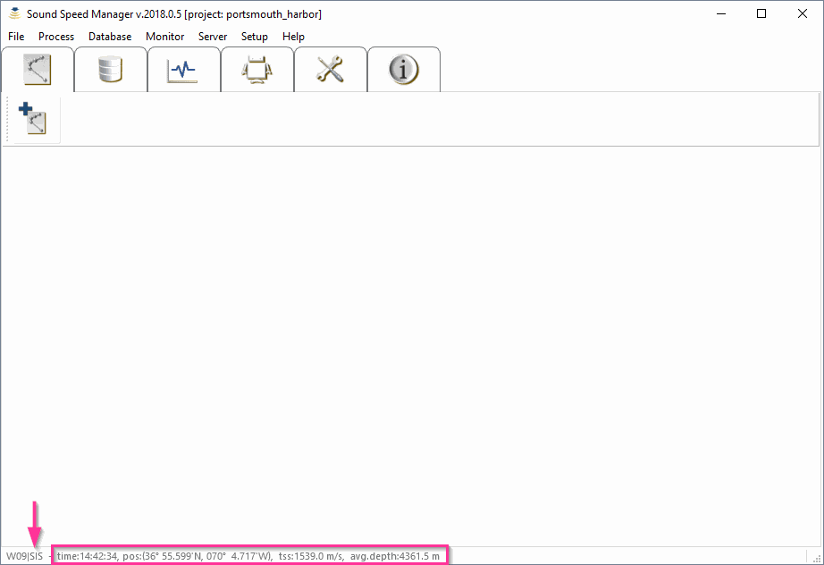

**************
Configurations
**************

Suggested configurations
========================

.. index:: configurations

Given its specific aim, *Sound Speed Manager* is usually installed to run in one of two configurations:

On the machine used for sound speed profile acquisition
-------------------------------------------------------

This represents a quite common choice since many of the operations accomplished in the software are typically done
immediately after acquisition of a cast.

If the machine is on the same network as the multibeam acquisition workstation,
the processed profile can be directly delivered via network.

When this is not possible, the package can export the processed data to files that can then be manually uploaded
to the multibeam workstation.

On the multibeam acquisition workstation
----------------------------------------

This configuration is particularly useful when it is anticipated that the software will run in *Server Mode*.
In fact, it is important that multibeam watch standers are able to monitor the server, and to disable it
in the event that a measured profile is to be uploaded.

Upgrading
=========

.. index:: upgrade;

It is possible to copy configuration settings from a previous installation.
When a new installation is performed, the user is prompted (see :numref:`existing_setup`) to select existing configuration settings (if any).

.. _existing_setup:

    Select the desired setup and click on the *OK* button to copy an existing setup.

Space requirements
==================

.. index:: WOA; WOA09

Approximately 500 MB of additional disk space is required for the WOA09 db set optionally required
(but warmly suggested) by this hydro-package. If not available, the package will attempt to download it.

Alternatively, it is also possible to manually download, unpack the WOA09 data set at any path that SSM can have access to, and modify the configuration file
to point to the correct path (see :ref:`package_configuration`).

By default, SSM looks for databases at:

* "C:/Documents and Settings/**<username>**/Application Data/HydrOffice/Sound Speed/atlases/**[woa09 or woa13]**" (WinXP), or
* "C:/Users/**<username>**/AppData/Local/HydrOffice/Sound Speed/atlases/**[woa09 or woa13]**" (newer Windows OS)

.. index:: WOA; WOA13

Among other improvements, the WOA13 db provides a much better spatial resolution, but this comes with a much larger data size (~18 GB).

.. note:: If a previous version of the application was installed, *Sound Speed Manager* will try to localize past
    installations of WOA databases (WOA09 or WOA13).

.. _package_configuration:

Package configuration
=====================

.. index:: configurations

In the *Sound Speed* release data folder, you can find a configuration file: ``setup.db``.

This SQLite database file has to be modified to reflect the chosen software deployment and environment-specific
configuration settings (e.g., the SIS IP address and ports).

Use the *Setup* tab to view the available configuration options in the database.
If you want to modify them, click on the 'Lock/Unlock' button (:numref:`setup_tab`).

.. _setup_tab:
.. figure:: ./_static/setup_tab.png
    :width: 600px
    :align: center
    :alt: alternate text
    :figclass: align-center

    When unlocking, you will be asked to confirm that you want to modify the setup.

.. index:: RTOFS

.. warning:: If you want to use the RTOFS data, Internet (and the port 9090) must be accessible from the machine in use.

Sound Speed Manager - SIS interaction
=====================================

.. index:: SIS

In order to automatically interact with *Kongsberg SIS*, some initial configuration are required on the *SIS* side
to make it to broadcast a specific subset of datagrams that can then be interpreted by the *SSP* hydro-package
(identification codes in parentheses):

* **Position** (‘P’, 80, 0x50): for retrieving current date and position

* **Sound Speed Profile** (‘U’, 85, 0x55): checking whether a SSP transmission was successful

* **XYZ88** (‘X’, 88, 0x58): to retrieve:

  * The surface sound speed (used in beam forming and steering) and the transducer draft (both used when augmenting SSPs with the measured surface sound speed value).
  * The depth (to estimate the approximate water depth). This is used in the sound speed, temperature and salinity plots to help the user appreciate the minimal depth to which the profiles should be extended.

*Kongsberg SIS* can be configured to broadcast datagrams in three different ways as discussed in the next sections.

.. _method_1:

Method #1
---------

This method is usually used for the case where the hydro-package and *SIS* are installed on the same machine.
However, since the *User Defined UDP* port cannot be modified, this method may not be suitable if this mechanism is
already in used by another program.
In such a case, the *DataDistrib.exe* program explored in :ref:`method_3` may be attempted.

The configuration for this method is actually quite simple:

* Stop pinging
* Access the *Installation Parameters* dialog (see :numref:`method_1_fig`) from the *View* menu by choosing *Tear off* and then *Installation Parameters*

.. _method_1_fig:

    *SIS Installation parameters* dialog, with key settings in red for :ref:`method_1`.

* Select the *PU Communication Setup* tab and then choose the *Output Setup* sub-tab.
* Choose *User Defined* from the *UDP Host Port* dropdown menu (the default output port varies with the MBES model). Take a note of this for configuring SSP Manager later.
* Select the following datagrams: *Depth*, *Position*, and *Sound Speed Profile*.
* Click the *OK* button at the top left of the tabbed panels.
* Restart pinging.

.. _method_2:

Method #2
---------

This method is more general, and it can be used for data transmission to other computers on the network
(by specifying IP address and port, as well as transmission rate).

.. note:: *SIS* needs to be restarted for the changes to take effect. Furthermore, since the software does not seem
          to validate user inputs, mistakes made cannot be easily discovered and undone (unsubscribe).

* From the *Tools* menu, choose *Custom…* and then *Datagram Distribution* (see :numref:`method_2_fig`).

.. _method_2_fig:

    *Datagram Distribution* dialog, with key settings in red for :ref:`method_2`.

* Choose the datagram from the drop down menu, starting with *Position (P)*.
* Type in the IP address of the remote machine where this hydro-package is installed, immediately followed by a colon (:), then  the port number that the data should be delivered to on the remote machine: e.g., ``192.168.1.67:16103``.
* Click the *Subscribe* button.
* Repeat Steps 2-4 for the *SVP (U)* and the *XYZ88 (X)* datagrams.

.. _method_3:

Method #3
---------

This method is required when multiple software packages need to receive data from *SIS*, and it represents
an extension of the previous two methods. It uses a standalone program, named *DataDistrib.exe*,
bundled with *SIS* and usually installed in *C:\\Program Files\\Kongsberg Maritime\\SIS\\bin*
(together with a configuration file *DataDistrib.ini* with all the subscriptions).

It is suggested to add the *DataDistrib.exe* to the *Startup* menu (so that it is automatically started).
However, common backsides of this method is that the executable can be accidentally closed (stopping the data
distribution to this package), or it can accidentally runs twice corrupting the configuration file
(to prevent this, it could be made ‘read only’).

The setup of this method is summarized as follows:

* If the program is running already, click the icon in the taskbar to launch the graphical user interface (see :numref:`method_3_fig`). If not, navigate to *C:\\Program Files\\Kongsberg Maritime\\SIS\\bin* and double click on *DataDistrib.exe* to launch it

.. _method_3_fig:

    The *Data Distrubution* application, with key settings in red for :ref:`method_3`.

* Find the first empty row and enter the UDP port from which *SIS* has to distribute data in the left most column. Hit the *Enter* key to finalize the entry
* In the same row, click on the fourth column and type in the IP address of the remote machine on which this package is installed, immediately followed by a colon (:), then port number that the data should be delivered to on the remote machine: e.g., 192.168.1.67:16103. Again, hit the *Enter* key to finalize the entry. If SIS is pinging and distributing the data, you should see the packet count increase steadily in the third column.
* To send data to another port on a computer already connected to SIS through the Data Distribution, simply click on column five in the same row as the existing connection. Enter the same IP address as in column four, followed by a colon, followed by the new port number (e.g. 192.168.1.67:26103). Again, hit the Enter key to finalize the entry.

Sound Speed Manager side
------------------------

The parameters, present in *setup.db*, can be modified using the *Setup* tab (:numref:`settings0`).

.. _settings0:

    The *Setup* tab, in red, can be used to inspect/modify the package settings.

By default, the *Setup* tab is in read-only mode. To be able to modify the package settings, you need to unlock it (:numref:`settings1`).

.. _settings1:

    The *Setup* tab must be unlocked for settings modifications.

Once unlocked, you can add a new setup, or you may want to modify one of the existing ones. For the interaction
with *SIS*, you need to access the *Input* sub-tab, the *Output* sub-tab, and the *Listeners* sub-tab.

In the *Input* sub-tab, you have to select "True" in the "Listen SIS" list (:numref:`settings2`).

.. _settings2:
.. figure:: ./_static/settings2.png
    :width: 600px
    :align: center
    :height: 440px
    :alt: SIS listener
    :figclass: align-center

    The *Listen SIS*, in red, is used to activate the *SIS* listening.

In the *Output* sub-tab, you have to add a client to the *client list* you need to specify (:numref:`settings3`):

* a name for the client (for ease of recognition)
* the client IP address to which the data should be sent by *Sound Speed Manager* (if the package is installed on the same machine as *SIS*, this should be ``127.0.0.1``)
* the port to which the client is listening for the sound speed profile (*SIS* always listens port ``4001`` for SSP input)
* the protocol in use: ``SIS``

.. _settings3:

    The *Client list*, in red, is used to add the *SIS* client information.

In the *Listeners* sub-tab, the *Listen port* entry, in red, provides the port to which *SIS* has been configured to broadcast datagrams (:numref:`settings4`).
This should match the port address selected in the previous methods. For instance, ``16103``.

.. _settings4:
.. figure:: ./_static/settings4.png
    :width: 600px
    :align: center
    :height: 440px
    :alt: SIS port
    :figclass: align-center

    The *Client list*, in red, is used to add the *SIS* client information.

If both *SIS* and *Sound Speed Manager* sides have been properly configured, *Sound Speed Manager* will show (in the right side
of the lower window statusbar, see :numref:`settings5`) the date, geographic position, surface sound speed and average depth (when *SIS* is pinging).

.. _settings5:

    The SIS-received information are displayed in the window statusbar.

.. note:: The surface sound speed and depth will only update if the echosounder is pinging (since the surface sound speed information can only be extracted when *Sound Speed Manager* receives the depth datagram).

