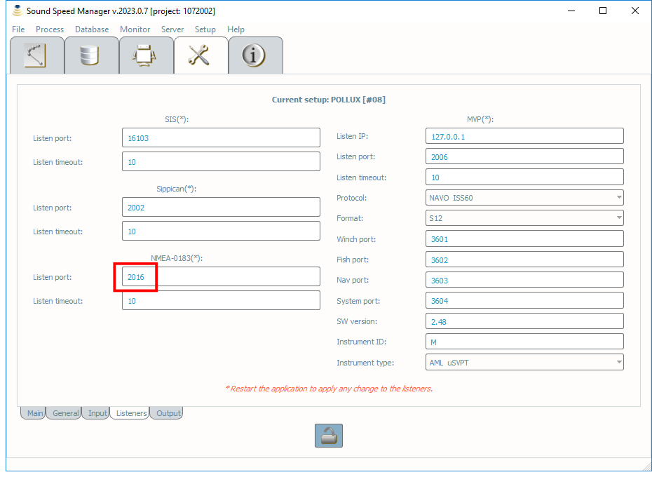
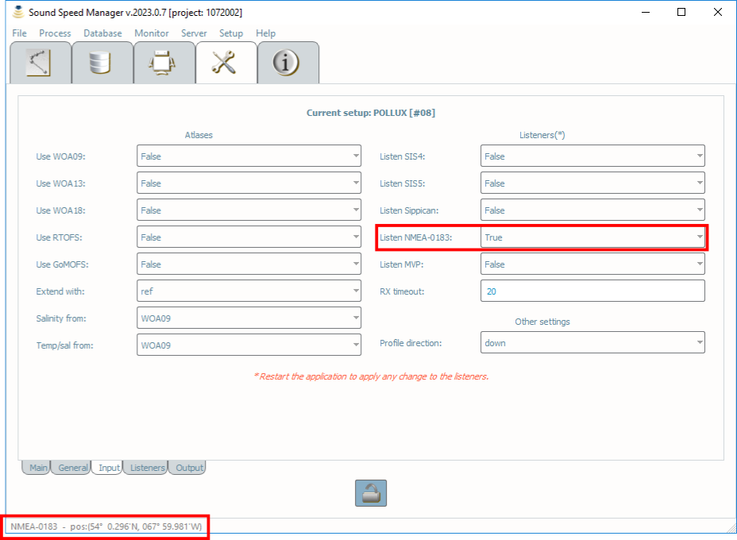

.. _nmea0183:

Sound Speed Manager - NMEA-0183 interaction
===========================================

.. index:: NMEA-0183;

A rudimentary NMEA-0183 listener can be used to capture the current location via a UDP broadcast of NMEA-0183 $--GGA or $--GLL sentences. This feature can be used to associate the current position to the sound speed profile formats that cannot store location information.

Open in editing mode the Sound Speed Manager’s Setup Tab, then set the NMEA-0183 listen port the Listeners sub-tab (see :numref:`ssm_nmea0183_listeners_fig`).

.. _ssm_nmea0183_listeners_fig:

    *Sound Speed Manager Setup Listeners* dialog, with the *Listen Port* setting and incoming NMEA-0183 data highlighted in red.

Then, switch to the Input sub-tab (see :numref:`ssm_nmea0183_input_fig`) and select the True value for the Listen NMEA-0183 field. After a **restart**, the current position is displayed in the status bar.    
    
.. _ssm_nmea0183_input_fig:

    *Input tab* in the Sound Speed Manager’s Setup.
