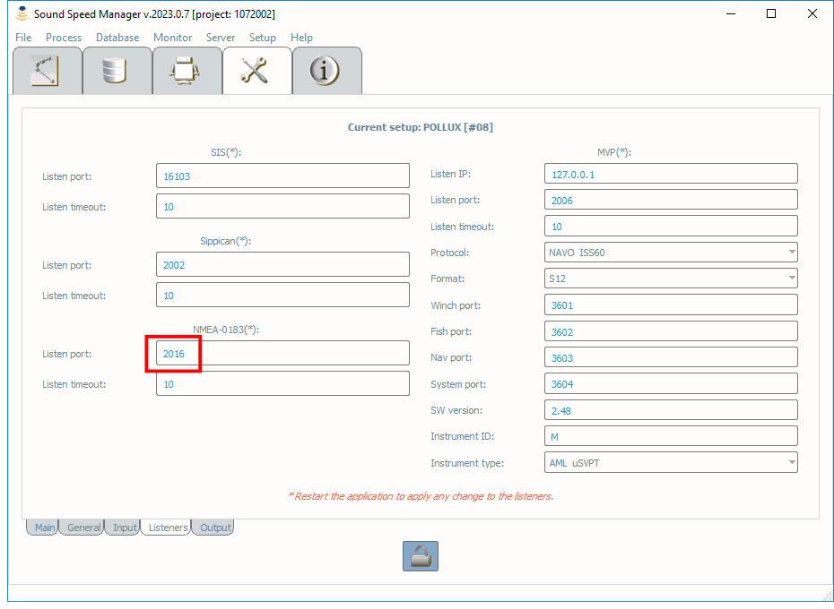
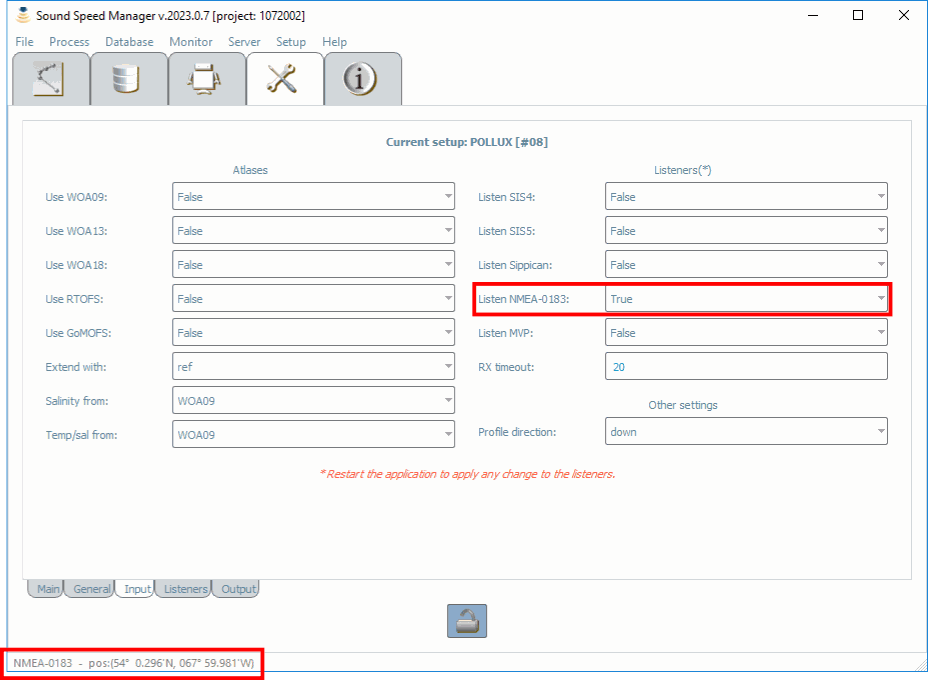

.. _nmea_0183:

Sound Speed Manager - NMEA 0183 interaction
===========================================

.. index:: NMEA; 0183

A basic NMEA 0183 listener is available to capture the current location via a UDP broadcast of NMEA 0183 $--GGA or
$--GLL sentences. This feature can be used to associate the current position for sound speed profiles that
do not store location information.

Open the *Setup Tab* and set the NMEA 0183 port in the *Listeners* sub-tab (see :numref:`nmea_0183_listeners_fig`).

.. _nmea_0183_listeners_fig:

    *Sound Speed Manager Setup Listeners* dialog, with the *Listen Port* setting and incoming NMEA 0183 data highlighted in red.

Then, switch to the *Input* sub-tab (see :numref:`nmea_0183_input_fig`) and set *True*  the *Listen NMEA 0183* field.
After a **restart**, the current position should be displayed in the status bar.
    
.. _nmea_0183_input_fig:

    *Input tab* in the Sound Speed Manager’s *Setup Tab*.
