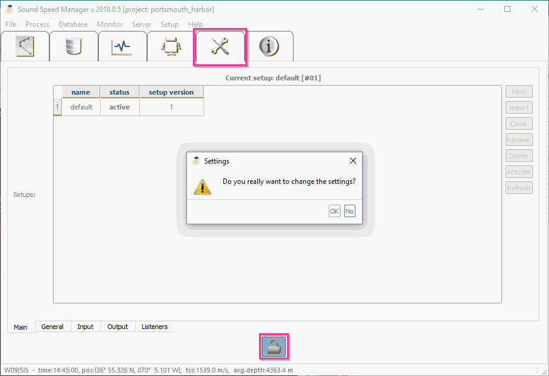

.. _application_settings:

Application Settings
====================

.. index:: settings

In the *Sound Speed* release data folder, you can find a configuration file: ``setup.db``.

This SQLite database file has to be modified to reflect the chosen software deployment and environment-specific
configuration settings (e.g., the SIS IP address and ports).

Use the *Setup* tab to view the available configuration options in the database.
If you want to modify them, click on the 'Lock/Unlock' button (:numref:`setup_tab`).

.. _setup_tab:

    When unlocking, you will be asked to confirm that you want to modify the setup.

.. index:: RTOFS

.. warning:: If you want to use the RTOFS data, Internet (and the port 9090) must be accessible from the machine in use.

NOAA Tools Flag
---------------

.. index:: NOAA tools, flag

For NOAA field, it is recommended to turn on the *NOAA tools* flag in the *General Settings* tab.

Currently, the *NOAA Tools* flag is mainly used for NCEI format output. When NOAA tools flag is on:

* In the *Setup* tab, the default institution is not editable.
* In the *Metadata* dialog, the vessel name is not editable
* During NCEI files exporting, the NOAA-specific project naming format is enforced.

.. note:: This flag is *True* by default when the setup is created withing Pydro.
