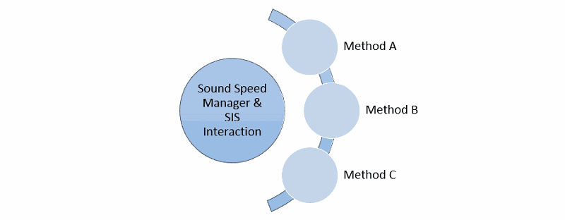

Sound Speed Manager - SIS v4 interaction
========================================

.. index:: SIS; v4

As with any communication between any software, whether it is on the same computer or between different computers on a
network, some setup is required. For SIS and Sound Speed Manager, all communication is done across User Datagram Protocol (UDP). UDP on
the same windows-based computer requires port numbers; UDP across a network requires both IP addresses on the network and port
numbers from each computer. *The easiest way to find this information for a given computer is by typing "ipconfig" into a
windows command prompt, and note the IPv4 Address.*

In order for Sound Speed Manager to automatically interact with *Kongsberg SIS*, some initial configuration are required
on the *SIS* side to make it to broadcast a specific subset of datagrams that can then be interpreted by the *SSP*
hydro-package (identification codes in parentheses):

* **Position** (‘P’, 80, 0x50): for retrieving current date and position

* **Sound Speed Profile** (‘U’, 85, 0x55): checking whether a SSP transmission was successful

* **XYZ88** (‘X’, 88, 0x58): to retrieve:

  * The surface sound speed (used in beam forming and steering) and the transducer draft (both used when augmenting
    SSPs with the measured surface sound speed value).
  * The depth (to estimate the approximate water depth). This is used in the sound speed, temperature and salinity plots
    to help the user appreciate the minimal depth to which the profiles should be extended.

.. _ssm_sis_interaction_fig:

    *Kongsberg SIS v4* can be configured to broadcast datagrams in three different ways as discussed in Methods A, B, and C.

.. _method_A:

Method A: Sound Speed Manager and SIS v4 Installed on the same Computer
-----------------------------------------------------------------------

This method is usually used for the case where *Sound Speed Manager* and *SIS* are installed on the same machine.
However, this method may not be suitable if this mechanism is already in used by another program.
In such a case, the *DataDistrib.exe* program explored in :ref:`method_C` should be attempted.

The configuration for this method is actually quite simple:

* Open *SIS*, do not "Ping"
* Under the *Installation Parameters* Tearoff, in *PU Communication Setup, Output Setup*

  * Choose *User Defined* from the *UDP Host Port* dropdown menu
  * Note the Port Address (the Display Port Address is used during the Sound Speed Manager Setup)
  * Select the following datagrams: Depth, Position, and Sound Speed Profile
  * Click the *OK* button on the top left of the *Installation Parameter* Tearoff and close the window

* Access the *Installation Parameters* dialog (see :numref:`method_A_fig`) from the *View* menu by choosing *Tear off*
  and then *Installation Parameters*

.. _method_A_fig:

.. figure:: ./_static/methodA.png
    :width: 847px
    :align: center
    :height: 488px
    :alt: figure with method A
    :figclass: align-center

    *SIS Installation parameters* dialog, with key settings in red for :ref:`method_A`.

* On the main SIS screen, start *Pinging*
* Open Sound Speed Manager, and open the *Setup Tab*, and unlock settings editing

  * Under *Output*, you can leave the client list set to default, or create a new client with IP = 127.0.0.1, port = 4001,
    and protocol = SIS (see :numref:`method_A_ssm_output_fig`). These settings will tell Sound Speed Manager that SIS is on the same computer,
    and to send the CTD cast data to port 4001 (KM default).

.. _method_A_ssm_output_fig:

    *Sound Speed Manager Setup Output* dialog, with key settings in red for :ref:`method_A`.

* Under *Listeners*, in the *Listen port*, enter the Port Address noted from the *User Defined UDP Host Port* in SIS.
  This will allow SIS to send a received CTD cast message to Sound Speed Manager, and well as real time data including time, position,
  surface sound speed, and average depth (see :numref:`method_A_ssm_listeners_fig`).

.. _method_A_ssm_listeners_fig:

    *Sound Speed Manager Setup Listeners* dialog, with the *Listen Port* setting and incoming SIS data highlighted in red for :ref:`method_A`.

.. note:: The surface sound speed and depth will only update if the echosounder is pinging (since the surface sound speed
   information can only be extracted when *Sound Speed Manager* receives the depth datagram).

You will now be able to send a sound speed profile from Sound Speed Manager to SIS and receive a receipt message
(see :numref:`method_A_ssm_sis_receipt_fig`), and see the SIS-received information displayed in the status bar.

.. _method_A_ssm_sis_receipt_fig:

.. figure:: ./_static/ssm_sis_receipt.png
    :width: 285px
    :align: center
    :height: 123px
    :alt: figure with ssm sis receipt
    :figclass: align-center

    *Sound Speed Manager SIS Receipt* dialog.

.. note:: The value of the *User Defined UDP* port in *SIS* cannot be modified.

.. _method_B:

Method B: Sound Speed Manager and SIS v4 Installed on Separate Computers within a Network
-----------------------------------------------------------------------------------------

This method is more general, and it can be used for data transmission to other computers on the network
(by specifying IP address and port, as well as transmission rate).

* In *SIS*, from the *Tools* menu, choose *Custom…* and then *Datagram Distribution* (see :numref:`method_B_fig`).

.. _method_B_fig:

.. figure:: ./_static/methodB.png
    :width: 400px
    :align: center
    :height: 460px
    :alt: figure with method B
    :figclass: align-center

    *Request Datagrams from EM* dialog, with key settings in red for :ref:`method_B`.

* Choose the datagram from the drop down menu, starting with *Position (P)*.
* Type in the IP address (e.g. 192.168.0.100) of the remote machine where Sound Speed Manager is installed, immediately followed by a colon (:),
  then  the port number (e.g. 16103) that the data should be delivered to on the remote machine: e.g., Entire address: ``192.168.0.100:16103``.
* Click the *Subscribe* button.
* Repeat Steps 2-4 for the *SVP (U)* and the *XYZ88 (X)* datagrams.

* With Sound Speed Manager open, go to the *Setup Tab*, and unlock setting editing (see :numref:`method_b_ssm_output_fig`).

  * In *Output*, create a new Client. Enter the SIS computer IP Address, use default port "4001", and protocol "SIS". Sound Speed Manager
    will send your cast from the acquisition computer, to this SIS connection.

.. note:: Local test should be removed from the Client list if you add an additional Client. Otherwise, this will cause a failed
   receipt message.

.. _method_B_ssm_output_fig:

    *Sound Speed Manager Setup Output* dialog, with key settings in red for :ref:`method_B`.

* Under Listeners, in the Listen port, enter the Port Address noted from Request datagrams from EM and the Enter the Listen
  port number (e.g. 16103). This is where Sound Speed Manager will be receiving messages from (see :numref:`method_B_ssm_listeners_fig`).

.. _method_B_ssm_listeners_fig:

.. figure:: ./_static/methodB_ssm_listeners.png
    :width: 618px
    :align: center
    :height: 472px
    :alt: figure with method B ssm listeners
    :figclass: align-center

    *Sound Speed Manager Setup Listeners* dialog, with the *Listen Port* setting and incoming SIS data highlighted in red for :ref:`method_B`.

.. note:: The surface sound speed and depth will only update if the echosounder is pinging (since the surface sound speed
   information can only be extracted when *Sound Speed Manager* receives the depth datagram).

You will now be able to send a sound speed profile from Sound Speed Manager to SIS and receive a receipt message
(see :numref:`method_B_ssm_sis_receipt_fig`), and see the SIS-received information displayed in the status bar.

.. _method_B_ssm_sis_receipt_fig:

.. figure:: ./_static/ssm_sis_receipt.png
    :width: 285px
    :align: center
    :height: 123px
    :alt: figure with ssm sis receipt
    :figclass: align-center

    *Sound Speed Manager SIS Receipt* dialog.

.. note:: *SIS* needs to be restarted for the changes to take effect. Furthermore, since the software does not seem to
   validate user inputs, mistakes made cannot be easily discovered and undone (unsubscribe).

.. _method_C:

Method C: Managing Multiple Software Connections to SIS v4, Including Sound Speed Manager
-----------------------------------------------------------------------------------------

This method is required when multiple software packages need to receive data from SIS v4, and it represents an extension of
the previous two methods. **Methods A and B are not required in addition to Method C.** SIS v4 uses a standalone program, named
*DataDistrib.exe*, bundled with SIS and usually installed in "C:/Program Files/Kongsberg Maritime/SIS/bin" (together with a
configuration file "DataDistrib.ini" with all the subscriptions).

It is suggested to add the *DataDistrib.exe* to the *Startup* menu of the computer, in Windows OS (so that it is automatically
started). However, common backsides of this method is that the executable can be accidentally closed (stopping the data
distribution to this package), or it can accidentally runs twice corrupting the configuration file (to prevent this, it
could be made "read only").

Because *Sound Speed Manager*, *SIS*, and *Data Distribution - MDM 400* are on different computers within a network, we have to know the
IP Addresses of each computer. The easiest way to find this information for a given computer is by typing "ipconfig" into
a windows command prompt, and note the IPv4 Address. With this information, we can tell Sound Speed Manager where to send our sound speed
profile.

The setup of this method is summarized as follows:

* In Sound Speed Manager, Setup, Output, unlock settings editing, and add a new Client.

  * Give the Client a name, enter the SIS computer IP Address, use default port "4001", and protocol "SIS". Sound Speed Manager will send
    your cast from the acquisition computer, to this SIS connection (see :numref:`method_c_ssm_output_fig`). Note: Local test
    should be removed from the Client list if you add an additional Client. This will caused a failed receipt message.

.. _method_C_ssm_output_fig:

.. figure:: ./_static/methodC_ssm_output.png
    :width: 720px
    :align: center
    :height: 493px
    :alt: figure with method C ssm output
    :figclass: align-center

    *Sound Speed Manager Setup Output* dialog, with key settings in red for :ref:`method_C`.

* In *SIS*, *Installation parameters*, *PU Communication Setup*, *Output Setup*, *UDP Host Port* drop down, select *User Defined* (note this Port address).

  * This address is used in *Data Distribution - MDM 400* as the source port (where the data is coming from)
    (see :numref:`method_c_sis_installation_fig`).

.. _method_C_sis_installation_fig:

.. figure:: ./_static/methodC_sis_installation.png
    :width: 847px
    :align: center
    :height: 488px
    :alt: figure with method C sis installation
    :figclass: align-center

    *SIS Installation Parameters* dialog, with key settings in red for :ref:`method_C`.

* In *Data Distribution - MDM 400*, messages will be sent from your "User Defined" UDP Host Port (noted in previous step) to
  any number of *Destination Ports* of your choosing.

  * First, the enter the "User Defined" UDP Host Port (from the previous step) in the "Source Port" column. The information
    for the "Destination: Port" column includes: the IP Address for the computer where Sound Speed Manager in located, followed by a ":" and
    the port number, which can be any port not already in use (e.g. 192.168.0.100: 16103). Note this port number; it will be
    used in the Sound Speed Manager setup.

.. _method_C_data_dist_fig:

    *Data Distribution - MDM 400* dialog, with key settings in orange for :ref:`method_C`.

* In Sound Speed Manager, Setup, Listeners, unlock settings editing.

  * Enter the Listen port number (the Destination Port number from Data Distribution - MDM 400). This is where Sound Speed Manager will be
    receiving messages from.

.. _method_C_ssm_listeners_fig:

.. figure:: ./_static/methodC_ssm_listeners.png
    :width: 618px
    :align: center
    :height: 472px
    :alt: figure with method C ssm listeners
    :figclass: align-center

    *Sound Speed Manager Setup Listeners* dialog, with the *Listen Port* setting and incoming SIS data highlighted in red for :ref:`method_C`.

For an example using Method C, see :numref:`method_C_sis_ssm_comms_fig` for a complete diagram. Here the "User Defined" Port
Address "16103" found in SIS's Installation Parameters, is enter in the "Source Port" column in Data Distribution - MDM 400.
The IP Address of the computer with Sound Speed Manager is entered in Data Distribution - MDM 400's
"Destination: Port" column, followed by an open port number, here "16103". This same port number is entered into Sound Speed
Manager's Listeners tab, in the "Listen port:" dialog.

.. _method_C_sis_ssm_comms_fig:

    *Complete Method C Diagram*, with key information and connections highlighted in orange for :ref:`method_C`.

You will now be able to send a sound speed profile from Sound Speed Manager to SIS and receive a receipt message
(see :numref:`method_C_ssm_sis_receipt_fig`), and see the SIS-received information displayed in the status bar.

.. _method_C_ssm_sis_receipt_fig:

.. figure:: ./_static/ssm_sis_receipt.png
    :width: 285px
    :align: center
    :height: 123px
    :alt: figure with ssm sis receipt
    :figclass: align-center

    *Sound Speed Manager SIS Receipt* dialog.
