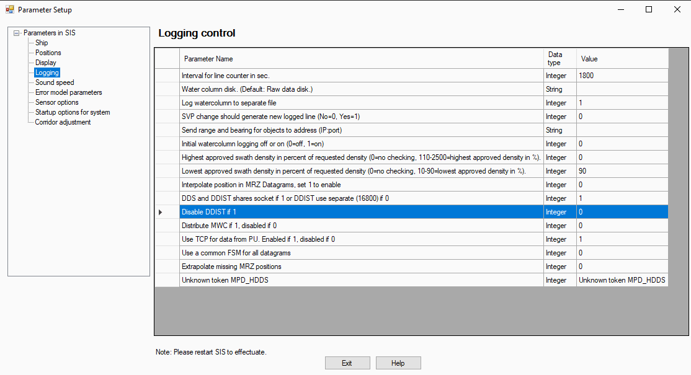
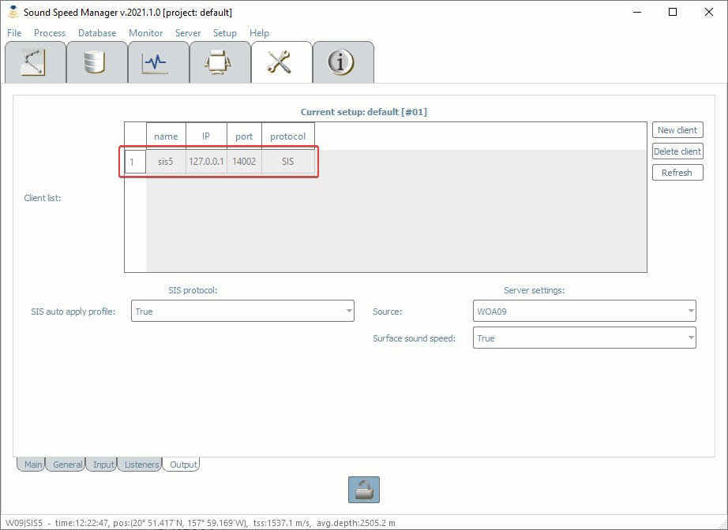

.. _ssm_sis5:

Sound Speed Manager - SIS v5 interaction
========================================

.. index:: SIS; v5
.. index:: K-Controller

SIS v5 is currently supported in two alternative ways:

* Using the dedicated *Sound Speed Manager (SSM) IP and port* field **[supported since SIS v5.14]** (see :ref:`ssm_sis5_sis_settings_new_method`).
* Through the Data Distribution application, usually installed with SIS v5 **[legacy method]** (see :ref:`ssm_sis5_sis_settings_old_method`).

The description covers both of the following cases:

* Sound Speed Manager and SIS v5 installed on the same machine.
* Sound Speed Manager and SIS v5 installed on the different machines.

.. _ssm_sis5_sis_settings_new_method:

SIS v5 settings using *Sound Speed Manager (SSM) IP and port* field
-------------------------------------------------------------------

This solution is available only in SIS 5.14 (and higher):

* In the SIS *Tools* menu, open the *Parameter Setup*.
* Navigate to the *sound speed* menu.
* In the *Sound Speed Manager (SSM) IP and port* field (see :numref:`sis_sound_speed_menu_fig`), enter the IP address of the SSM workstation and the port number (e.g., 16103). If SIS and SSM are on the same computer, use: 127.0.0.1:16103
* Restart SIS.

.. _sis_sound_speed_menu_fig:

.. figure:: ./_static/sis_sound_speed_menu.png
    :width: 580px
    :align: center
    :alt: figure with SIS Sound Speed menu
    :figclass: align-center

    SSM datagram configuration in SIS.

.. _ssm_sis5_sis_settings_old_method:

SIS v5 settings through Data Distribution (*legacy method*)
-----------------------------------------------------------

.. note::
    For a known bug in SIS 5.15.0, this solution does not work. Please use a different version of SIS (e.g., 5.15.1).

Verify Data Distribution settings in SIS v5:

* Open *SIS*.
* Under *Tools* in *Parameter Setup*/*Logging*, locate the *Disable DDIST if 1* entry (see :numref:`enable_data_dist_fig`).
* If the value of *'Disable DDIST if 1'* is 1, change the value to 0 and restart SIS.

.. _enable_data_dist_fig:

    The *'Disable DDIST if 1'* entry under *Tools* in *Parameter Setup*/*Logging*.

Under the SIS v5 installation folder, locate and execute 'DataDist.exe'. Once started, you need the following
settings (see :numref:`data_dist_exe_fig`):

* Select the Echo Sounder.
* Add a datagram distribution.
* Write (and remember!) the IP address and the port where you want to send the datagrams: e.g., '127.0.0.1:16103'.
* Select the following datagram types: MRZ, SPO and SVP.
* Save the configuration.

.. _data_dist_exe_fig:

    *Data Distribution Configuration* application with required settings.

.. warning::
    Data Distribution requires to have SIS v5 in execution.
    Setups with the K-Controller interacting with acquisition software different from SIS v5 are *currently* unsupported.

.. _ssm_sis5_ssm_settings:

SSM settings
------------

Open in editing mode the Sound Speed Manager’s Setup Tab, then set the SIS listen port (that you have set in
the Data Distribution Configuration or in the *Sound Speed Manager (SSM) IP and port* field) in the Listeners
sub-tab (see :numref:`ssm_sis5_p1_fig`).

.. _ssm_sis5_p1_fig:

    *Listeners tab* in the Sound Speed Manager’s Setup.

Then, switch to the Input sub-tab (see :numref:`ssm_sis5_p2_fig`) and select the True value for the Listen SIS v5 field.

.. _ssm_sis5_p2_fig:

    *Input tab* in the Sound Speed Manager’s Setup.

The previous steps are required to make Sound Speed Manager able to listen survey data from SIS v5 (through the
Data Distribution application).

In order to be able to transmit to SIS v5, you need to add a client in the Output sub-tab
(see :numref:`ssm_sis5_p3_fig`) using the following settings:

* IP: 127.0.0.1  *(if SIS v5 is on the same machine, otherwise the network IP address of the other machine)*
* port: 14002  *(always!)*
* protocol: SIS  *(always!)*

.. _ssm_sis5_p3_fig:

    *Output tab* in the Sound Speed Manager’s Setup.

Now **restart** Sound Speed Manager. If a SIS-controlled sonar is pinging, you should start
to see the parsed information in the status bar (see :numref:`ssm_sis5_p2_fig`).

.. note::
    In case of troubles in configuring the interaction between SSM and SIS, use :ref:`ssm_sis`.
